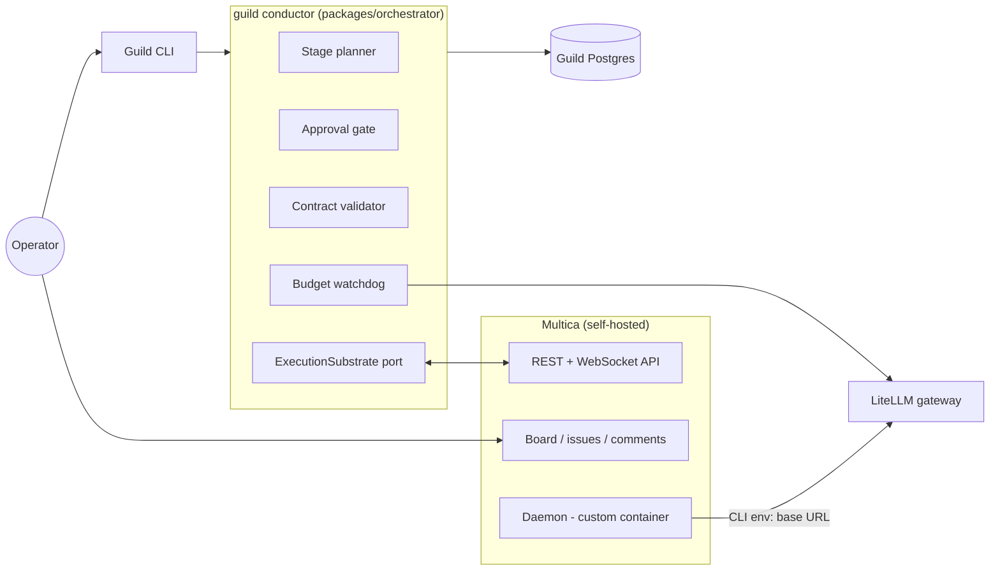
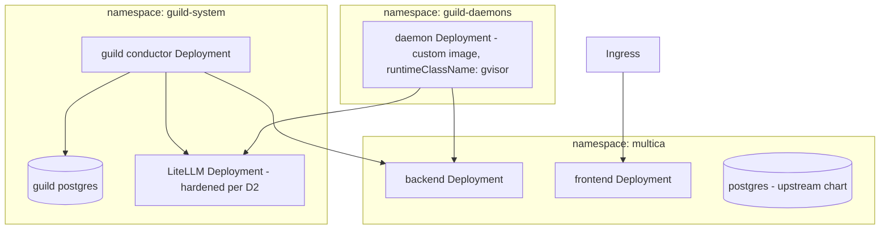

# Guild — Architecture

Status: **repositioned 2026-07-29** — Guild is now the autonomous-SDLC governance layer over a self-hosted Multica execution substrate (decision D8). Decision records D1–D7 are preserved below with their current status: three are superseded by the reposition, four are retained. Evidence: [VALIDATION-2026-07-29.md](VALIDATION-2026-07-29.md), [research/multica-comparison-2026-07-29.md](research/multica-comparison-2026-07-29.md), [research/multica-investigation-2026-07-29.md](research/multica-investigation-2026-07-29.md). The pre-reposition architecture is in git history.

## Overview



Guild is one service. It plans, gates, dispatches, validates, and enforces budget; Multica executes, displays, and routes conversations; the LiteLLM gateway meters every model call the agents make.

## Components

| Package | Responsibility |
|---|---|
| `packages/shared` | Published language: stage/plan/engagement types, `HandoffContract`, the `ExecutionSubstrate` port and its event types. Dependency-free. |
| `packages/orchestrator` | The Guild conductor: stage planner, approval gate, contract validator, budget watchdog. Hexagonal per D7 — Multica and LiteLLM live behind ports. |
| `packages/substrate-multica` | `ExecutionSubstrate` adapter over Multica's REST/WS API (PAT auth) — issues, assignment, comments, status/usage events. |
| `deploy/` | docker-compose for the full local stack; K8s manifests at M3: upstream Multica Helm chart + custom daemon Deployment + Guild + LiteLLM. |
| `docker/daemon/` (M1) | The custom Multica daemon image Guild contributes: `multica` binary, agent CLIs, git, headless token login, LiteLLM env routing. |

## Decision Records

### D8 — Multica as execution substrate (added 2026-07-29)

| Option | Pros | Cons |
|---|---|---|
| **Drive self-hosted Multica via its API** ✔ | Reuses a hardened board, 14+ runtime adapters, skills catalog, comment routing (verified deterministic), usage recording; 100% of Guild effort goes to the differentiated governance layer; context-freshness falls out of issue-per-engagement (verified session mechanics) | License is source-available with a vendor terms-change clause; agent/squad-management API surface unverified; daemon container unofficial (we build it) |
| Build own platform (original plan) | Full control, pure event-sourced design | Rebuilds ~60% of shipped, hardened Multica surface before any differentiator is testable — rejected on evidence, see comparison report |
| Backend-agnostic thin layer from day one | Hedges substrate risk | Abstraction without a second concrete substrate is speculation; the `ExecutionSubstrate` port already preserves this as the exit path |

**License constraints (normative):** personal self-hosting + a non-commercial open-source Guild driving its own instance's API sits inside Multica's internal-use carve-out (LICENSE:19–20). Guild must never: host Multica for third parties, embed it in anything sold, or rebrand its UI. Multica's license is **not** OSI open source and the vendor may tighten terms in future releases — pin the Multica version, review the LICENSE diff on every upgrade.

**Revisit if:** the license tightens against the carve-out; the API proves too thin for contracted dispatch or agent management (fall back to the backend-agnostic option via the port); or Multica ships native gates/contracts/budgets that make Guild's layer redundant.

### D1 — Inter-agent communication: NATS JetStream — **SUPERSEDED by D8**

Guild no longer operates an agent-to-agent bus: Multica owns agent coordination (task queue + deterministic comment routing, verified in source). Guild v2 is a single service consuming Multica's WebSocket stream; an internal bus is unjustifiable at this scale. The D1 analysis (NATS over Redis/Kafka; standards watch on MCP/A2A/AG-UI) remains valid history and the standards watch continues under D8's revisit clause. **Reinstate trigger:** Guild itself becomes multi-service with fan-out needs.

### D2 — Model access: LiteLLM gateway — **RETAINED, mechanism changed**

The gateway now sits behind the daemon image: agent CLIs inside the container are pointed at LiteLLM (`ANTHROPIC_BASE_URL` et al.), preserving per-role model policy, central spend metering, and the supply-chain rules from the original D2 (pin version + image digest; delayed scanned upgrades; hardened gateway pod). This is also what makes budget *enforcement* possible at all — verified in Multica's source: it records cost but enforces nothing, so the watchdog's data must come from Guild's own gateway. Feature-parity acceptance test (prompt caching, extended thinking through the proxy) carries over to M1.

### D3 — AgentRuntimeAdapter — **SUPERSEDED by D8, narrowed to the `ExecutionSubstrate` port**

Multica owns runtime adapters (14+ CLIs, exceeding our entire former roadmap). What survives is the *shape* of D3: one port, `ExecutionSubstrate`, owned by `packages/shared`, with `substrate-multica` as its first adapter. The port keeps Guild substrate-agnostic — the D8 fallback is "write a second adapter," not "rewrite Guild." Serializable handles, permission surfaces, and interrupts are now Multica's concern; Guild's port needs: create/assign/comment/cancel work items, watch events, read usage.

### D4 — Event streams as truth, Postgres projection — **SUPERSEDED by D8**

Guild's own state (plans, gates, contract verdicts, budget ledger) is a plain Postgres schema in one service — event sourcing an audit's worth of governance decisions through JetStream was justified for a platform, not for a conductor. The stream-retention/idempotency analysis remains valid history. Guild treats Multica's timeline as the execution audit trail and keeps its own append-only `decisions` table for governance provenance. **Reinstate trigger:** per old D4 revisit — if governance state accretes replay/timer/compensation needs, evaluate DBOS first (TypeScript-native, Postgres-only), not a bus.

### D5 — Next.js/SSE UI — **SUPERSEDED by D8**

Multica's board is the UI. Guild ships a CLI first; plan approval works through the CLI (and a bounded auto-approve timer), with blocker visibility read from the substrate stream. If Guild later grows its own thin approval UI, the old D5 analysis (SSE-first, AG-UI-aligned payloads) applies unchanged.

### D6 — Specification & handoff discipline — **RETAINED, now the core product**

Unchanged in substance, elevated in role: the plan-approval gate, machine-checkable handoff contracts, trace visibility, and single-writer discipline are no longer one decision among eight — they are the product. Concrete grounding added by the research: multica#1579 (trusted self-report failure) is the documented real-world case for contract validation; multica#815 and #1943 are the community demand for stages and gates. Contract mechanics:

- A `HandoffContract` = executable Gherkin acceptance criteria + concrete checks (command exit codes, artifact existence), authored by the upstream role *before* implementation.
- **Guild runs the validation** — in its own environment, never the implementing agent's session — and posts the verdict as a comment on the engagement issue. Self-reports are hostile input.
- Single-writer: one engagement = one Multica issue = one agent = one branch; merges are Guild-mediated.

### D7 — Hexagonal + DDD, TDD/BDD — **RETAINED**

Unchanged. The reposition simplifies the context map: **Governance context** (`orchestrator`: Plan, Stage, Engagement, HandoffContract, BudgetLedger) and the substrate boundary (`substrate-multica` as an anti-corruption layer — Multica's issue/comment/status vocabulary is translated at the adapter, never leaking into the domain). `packages/shared` remains the published language. BDD doubles as product mechanism per D6. Normative rules in root `CLAUDE.md`.

## Engagement lifecycle

```
Planned → Gated(awaiting approval) → Dispatched → Working ⇄ Blocked(question) → Reported → Validated | Bounced → Accepted
```

- **Context-fresh by construction:** one Multica issue per engagement; Multica's verified session mechanics (resume is scoped to the same agent+issue+workdir) mean a new issue always starts a fresh LLM context. Role continuity comes from role-memory artifacts composed into the engagement brief, never from accumulated conversation.
- **Bounced** work returns to the same issue (session resume gives the agent its prior context plus the failing criteria — the one place resume is desirable).
- Budget: the watchdog meters gateway spend per engagement tag; soft cap → warn, hard cap → cancel via substrate + stop dispatching.

## Kubernetes topology (target, M3)



- Multica control plane via its upstream Helm chart (verified: backend/frontend/postgres/ingress only — no daemon template exists).
- **Daemon Deployment is Guild's contribution**: custom image (multica binary + agent CLIs + git), headless `multica login --token` from a Secret, `runtimeClassName: gvisor` (Multica adds no sandboxing of its own — verified; the pod boundary is the only boundary, so harden it), NetworkPolicy egress limited to the Multica backend, LiteLLM, and git hosts, DNS scoped to the cluster resolver.
- Provider keys live only in LiteLLM's secret; the daemon holds only its Multica token and git credentials.
- The end-to-end daemon container is **untested** — building and proving it is the first M1 task, before anything depends on it.

## Open Questions

1. Multica's agent/squad **management** API surface (create/configure agents programmatically) — required for M4 hiring, unverified; resolve by probing the API against a local instance early in M1.
2. Plan-approval UX: CLI-only vs. also mirroring the plan as a Multica issue the operator approves by comment. Decide in M1 from actual use.
3. Where generated products live — child repos vs. monorepo of outputs (carried over; decide before M2 delivery stage).
4. Whether Multica's usage/timeline API exposes enough per-task cost for the watchdog to cross-check the gateway numbers (nice-to-have reconciliation).
