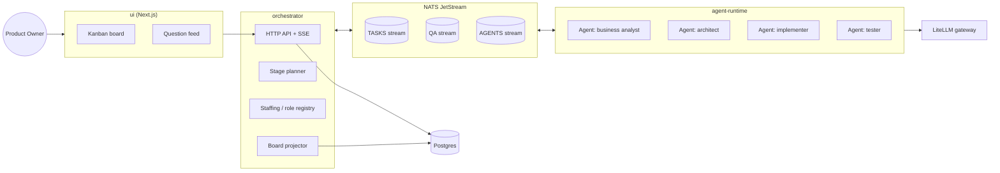
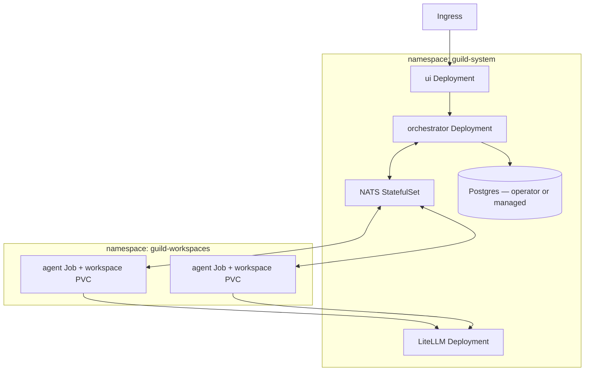

# Guild — Architecture

Status: accepted for M1–M2 scope; decisions D1–D5 recorded below with alternatives considered. Revisit points are listed per decision.

## Overview



Everything between components is an event on the bus; the database is a queryable projection, never the source of truth. Agents are processes managed by the `agent-runtime` behind an adapter interface — child processes in development, Kubernetes Jobs in production (M5).

## Components

| Package | Responsibility |
|---|---|
| `packages/shared` | Event contracts, subject naming, task/agent/question types. The only package every other package depends on. |
| `packages/orchestrator` | Project lifecycle, stage planning, staffing decisions, board projection, HTTP API + SSE for the UI. |
| `packages/agent-runtime` | Agent lifecycle (provision → run → retire), workspace management, bridges runtime adapters to the bus. |
| `packages/adapters` | `AgentRuntimeAdapter` implementations. First: Claude Code (headless via Claude Agent SDK). Later: OpenCode, others. |
| `packages/ui` | Next.js app: kanban board, question feed, project intake. |
| `deploy/` | docker-compose for development; Helm chart and K8s manifests from M5. |

## Decision Records

### D1 — Inter-agent communication: NATS JetStream

| Option | Pros | Cons |
|---|---|---|
| In-process EventEmitter | Zero infra, trivial dev loop | Single process only; contradicts agents-as-pods target; would force a second implementation later |
| Redis Streams | Familiar, light | Consumer-group ergonomics are clunky; no first-class request-reply; Redis licensing churn |
| **NATS JetStream** ✔ | Single small binary; CNCF; subject hierarchy maps directly to agent addressing; built-in request-reply fits Q&A routing; durable streams give replayable history | One more moving part in dev (mitigated: docker-compose) |
| Kafka | Enterprise pedigree, ecosystem | Heavy operationally; partition/ordering semantics overkill for team-sized message volume |

Request-reply for question routing and subject-per-agent addressing are the deciding features — they eliminate a custom routing layer. Dev and prod use the same bus (via docker-compose) so there is exactly one communication implementation.

**Revisit if:** message volume or cross-region requirements ever exceed what a single NATS cluster handles (unlikely at team scale).

### D2 — Model access: LiteLLM gateway, with native-SDK escape hatch

| Option | Pros | Cons |
|---|---|---|
| Per-provider SDKs in every adapter | Full feature access | N×M integration matrix (runtimes × providers); scattered cost tracking |
| **LiteLLM gateway** ✔ | One OpenAI-compatible endpoint covering native providers, Ollama, OpenRouter; central cost/budget tracking, keys, fallbacks | Lowest-common-denominator API for provider-specific features |
| OpenRouter only | Simple | Cloud-only; no local Ollama; single vendor for routing |

The gateway is the default path and the single place where the per-role **model policy** lives (e.g. architect → high-capability tier, implementer → mid tier, summarization → local Ollama). Adapters that wrap full agentic clients (Claude Code) may talk to their provider natively when the client requires it — the policy still assigns which model, the gateway still records spend where possible.

**Revisit if:** LiteLLM's translation layer blocks a capability an agent runtime needs routinely.

### D3 — Agent runtimes: adapter interface, Claude Code first

Every runtime (Claude Code, OpenCode, future clients) is wrapped in one interface owned by `packages/shared`:

```ts
interface AgentRuntimeAdapter {
  provision(spec: AgentSpec): Promise<AgentHandle>;   // compose AGENTS.md, select skills/MCP/hooks, prepare workspace
  run(handle: AgentHandle, assignment: TaskAssignment): AsyncIterable<AgentEvent>;
  deliverAnswer(handle: AgentHandle, answer: Answer): Promise<void>;
  retire(handle: AgentHandle): Promise<void>;
}
```

`AgentSpec` carries the role template, the project context, the selected capability manifest (skills, MCP servers, hooks), and the model assignment. Adapters translate between the runtime's native mechanisms (hooks, session events, stdout protocols) and Guild's event contracts — the rest of the system never knows which client an agent runs on.

Claude Code goes first because its headless Agent SDK, hook system, and AGENTS.md/CLAUDE.md conventions map one-to-one onto `AgentSpec`.

**Revisit if:** a second adapter (M3) reveals the interface is Claude-shaped rather than runtime-neutral.

### D4 — Persistence: event streams as truth, Postgres as projection

JetStream streams (`TASKS`, `QA`, `AGENTS`) are the system of record; the orchestrator projects them into Postgres for queries the UI needs (board state, question feed, history). Rebuilding a projection is a replay, not a migration. Postgres also stores non-event data: role templates, capability catalog, project metadata.

Alternative considered — Postgres-only with LISTEN/NOTIFY: fewer moving parts, but couples every component to the database schema and gives up replay and subject-based addressing; rejected.

### D5 — UI: Next.js, server-sent events for liveness

Next.js (App Router) serves the board and question feed; live updates arrive over SSE from the orchestrator API (WebSockets deferred — the flow is server→client push, SSE is simpler through proxies). The UI is a pure client of the orchestrator API; it never touches the bus or database directly.

## Agent Lifecycle

```
Requested → Provisioned → Active ⇄ Waiting(question) → Idle → Retired
```

1. **Requested** — stage planner or (M4) hiring policy determines a role is needed.
2. **Provisioned** — runtime adapter composes the agent: role template + project context → `AGENTS.md`; capability catalog filtered by role → skills/MCP/hooks; model policy → model assignment; isolated workspace created.
3. **Active** — agent claims tasks from its role's queue, emits progress events.
4. **Waiting** — agent posted a question; only dependent tasks block.
5. **Idle → Retired** — no matching demand; workspace archived, handle released. Retirement is an event like everything else, so the board shows team history.

## Event Contracts (summary)

Subjects follow `guild.<projectId>.<domain>.<event>`; full schemas live in `packages/shared/src/events.ts`.

| Subject pattern | Stream | Examples |
|---|---|---|
| `guild.*.task.>` | TASKS | `task.created`, `task.claimed`, `task.moved`, `task.done` |
| `guild.*.qa.>` | QA | `qa.asked` (reply-to carries routing), `qa.answered` |
| `guild.*.agent.>` | AGENTS | `agent.hired`, `agent.retired`, `agent.progress` |
| `guild.<p>.agent.<id>.inbox` | — | direct addressing: assignments, answer delivery |

Every event carries an envelope: `id`, `projectId`, `causationId`, `correlationId`, `occurredAt`, `actor` (agent id or `user`). Question routing is the correlation id: the answer event's `correlationId` equals the question's `id`, and the runtime delivers it to the asking agent's inbox subject.

## Kubernetes Topology (target, M5)



- One **Job per agent engagement**, workspace on a PVC; NetworkPolicy restricts agent pods to NATS + LiteLLM egress only.
- Model keys live only in the LiteLLM deployment's secret — agent pods never hold provider credentials.
- Until M5, `agent-runtime` runs agents as local child processes behind the same adapter interface; the lifecycle and events are identical.

## Cost & Safety Controls

- Per-role model tiers (D2) keep expensive models for the roles that need them; local models via Ollama for cheap/private work.
- Per-project budget ceilings enforced at the gateway (hard stop + board notification) — M6 for enforcement, tracked from M1.
- Agents operate only inside their provisioned workspace; anything outward-facing (deploys, repo pushes) goes through orchestrator-mediated, policy-checked steps.

## Open Questions

Tracked as GitLab issues rather than resolved prematurely:

1. Workspace handoff between roles — shared repo with branch-per-task vs. artifact passing (leaning branch-per-task; decide in M1).
2. Where generated products live — child repos under a GitLab group vs. monorepo of outputs (decide before M1 delivery stage).
3. Question triage UX when multiple agents ask simultaneously (M2 design task).
