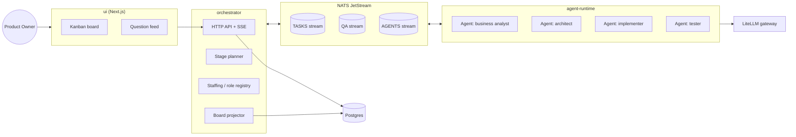
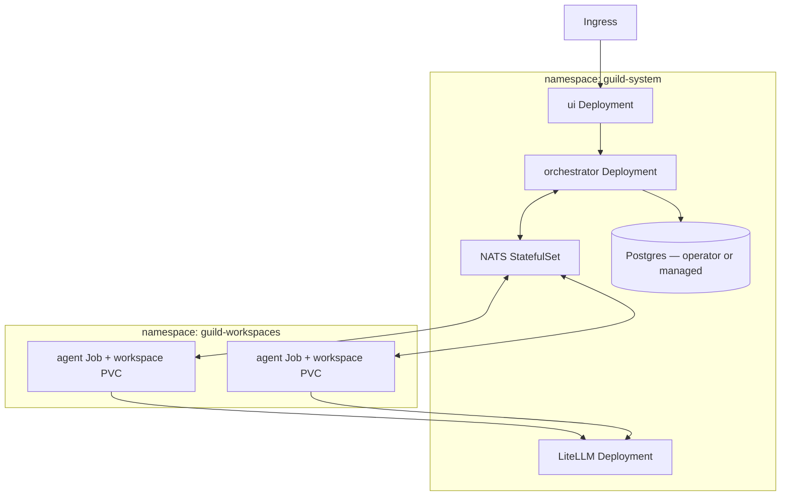

# Guild — Architecture

Status: accepted for M1–M2 scope; decisions D1–D7 recorded below with alternatives considered. Revisit points are listed per decision. Amended 2026-07-29 after external validation against the current agent ecosystem — see [VALIDATION-2026-07-29.md](VALIDATION-2026-07-29.md) for evidence and sources.

## Overview



Everything between components is an event on the bus; the database is a queryable projection, never the source of truth. Agents are processes managed by the `agent-runtime` behind an adapter interface — child processes in development, Kubernetes Jobs in production (M5).

## Components

| Package | Responsibility |
|---|---|
| `packages/shared` | Event contracts, subject naming, task/agent/question types. The only package every other package depends on. |
| `packages/orchestrator` | Project lifecycle, stage planning, staffing decisions, board projection, HTTP API + SSE for the UI. |
| `packages/agent-runtime` | Agent lifecycle (provision → run → retire), workspace management, bridges runtime adapters to the bus. |
| `packages/adapters` | `AgentRuntimeAdapter` implementations. First: Claude Code (headless via Claude Agent SDK). Second: OpenCode server mode — verified mappable, see D3. |
| `packages/ui` | Next.js app: kanban board, question feed, project intake. |
| `deploy/` | docker-compose for development; Helm chart and K8s manifests from M5. |

## Decision Records

### D1 — Inter-agent communication: NATS JetStream

| Option | Pros | Cons |
|---|---|---|
| In-process EventEmitter | Zero infra, trivial dev loop | Single process only; contradicts agents-as-pods target; would force a second implementation later |
| Redis Streams | Familiar, light | Consumer-group ergonomics are clunky; no first-class request-reply; Redis licensing churn |
| **NATS JetStream** ✔ | Single small binary; CNCF; subject hierarchy maps directly to agent addressing; built-in request-reply fits Q&A routing; durable streams give replayable history | One more moving part in dev (mitigated: docker-compose) |
| Kafka | Enterprise pedigree, ecosystem | Heavy operationally; partition/ordering semantics overkill for team-sized message volume |

Request-reply for question routing and subject-per-agent addressing are the deciding features — they eliminate a custom routing layer. Dev and prod use the same bus (via docker-compose) so there is exactly one communication implementation.

**Standards watch (recorded 2026-07-29):** the interop layer is moving toward coordination territory — MCP's 2026 roadmap names agent communication a priority area, and A2A v1.0 is stable under the Linux Foundation. D1 stands because neither provides durable queues, per-agent subject addressing, or an event-sourced record. Standing actions: re-check the standards **quarterly** (not at milestone boundaries); scope an A2A adapter before any external-agent hiring; evaluate AG-UI payload alignment before M2 UI hardening (see D5); watch Synadia's NATS Agent Protocol — adjacent but not identical to our scheme (its subjects are verb-first, not per-agent).

**Revisit if:** a quarterly standards check shows A2A/MCP covering internal durable coordination, or message volume / cross-region requirements exceed a single NATS cluster.

### D2 — Model access: LiteLLM gateway for all runtimes; native-direct is a documented exception

| Option | Pros | Cons |
|---|---|---|
| Per-provider SDKs in every adapter | Full feature access | N×M integration matrix (runtimes × providers); scattered cost tracking |
| **LiteLLM gateway** ✔ | One OpenAI-compatible endpoint covering native providers, Ollama, OpenRouter; central cost/budget tracking, keys, fallbacks | Lowest-common-denominator API for provider-specific features |
| OpenRouter only | Simple | Cloud-only; no local Ollama; single vendor for routing |

The gateway is the path for **all** runtimes and the single place where the per-role **model policy** lives (e.g. architect → high-capability tier, implementer → mid tier, summarization → local Ollama). This includes Claude Code: LiteLLM officially supports routing the Claude Agent SDK through the proxy via `ANTHROPIC_BASE_URL`, so the M1 adapter routes through the gateway by default. Native-direct provider access is the exception, and it requires (a) a documented capability blocker and (b) spend reconciliation back into the gateway's accounting. **M1 acceptance test:** Claude feature parity through the proxy — prompt caching and extended thinking demonstrably working — before the adapter is considered done.

**Supply-chain hardening (mandatory).** LiteLLM's PyPI releases 1.82.7/1.82.8 were compromised on 2026-03-24 (TeamPCP campaign; payload included Kubernetes lateral movement and a persistent backdoor). Guild's design makes the gateway pod the sole holder of every provider credential — maximal blast radius. Therefore: pin the exact LiteLLM version **and** container-image digest; upgrade on a delayed, scanned window (never day-of-release); run the gateway in a dedicated namespace with its own egress NetworkPolicy and a non-privileged service account.

**Operational notes.**

- LiteLLM's Python→Rust hot-path migration is in flight (`/messages` endpoint ~Sept 2026, full server ~Dec 2026 — overlapping M1–M2); pin versions and gate upgrades through the migration; watch for Anthropic-endpoint, routing, or budget regressions.
- Genuine hard budget stops require Redis **plus** LiteLLM's fail-closed enforcement setting (known accuracy bugs allow overruns otherwise). Until M5 we accept a single-replica gateway (documented SPOF); at M5 either add Redis/Valkey to the stack or re-document the acceptance. The `litellm-operator` (CRDs) is an option for M5 declarative config.
- Competing gateway benchmarks (Bifrost, Kong, etc.) are vendor-sourced with mock upstreams; gateway overhead is immaterial against inference latency at Guild's scale.

**Revisit if:** proxy feature parity regresses on the Anthropic endpoint, the Rust migration destabilizes routing/budgets, or a capability blocker forces routine native-direct use.

### D3 — Agent runtimes: adapter interface, Claude Code first

Every runtime (Claude Code, OpenCode, future clients) is wrapped in one interface owned by `packages/shared`:

```ts
interface AgentRuntimeAdapter {
  provision(spec: AgentSpec): Promise<AgentHandle>;   // compose AGENTS.md, map capabilities, prepare workspace
  run(handle: AgentHandle, assignment: TaskAssignment): AsyncIterable<GuildEvent>;
  deliverAnswer(handle: AgentHandle, answer: Answer): Promise<void>;
  respondToPermission(handle: AgentHandle, requestId: string, decision: PermissionDecision): Promise<void>;
  interrupt(handle: AgentHandle, taskId?: string): Promise<void>;   // stop current work; the agent survives
  retire(handle: AgentHandle): Promise<void>;
}
```

Three surfaces exist because both target runtimes expose them natively and the rest of the design depends on them:

- **Permissions** — the Cost & Safety section requires orchestrator-mediated policy checks; agents surface permission requests as events with a required reply path, answered via `respondToPermission` (Claude SDK `canUseTool`; OpenCode permissions endpoint). Without this, policy checks have no delivery mechanism.
- **Interrupt** — distinct from `retire()`: stop the current engagement without destroying the agent. Verify behavior against the current Claude Agent SDK release when implementing (an earlier unclean-interrupt issue appears fixed upstream).
- **Serializable handles** — `AgentHandle` carries the runtime's native session id and must be persistable, enabling suspend/resume of `Waiting` agents (Claude SDK session resume; OpenCode server sessions). Required for M5 Job-per-engagement economics and crash recovery.

`AgentSpec` carries the role template, the project context, the selected capability manifest, and the model assignment. Capability entries are **runtime-neutral**; each adapter maps them to its native mechanisms (Claude Code hooks, OpenCode plugins, …). The per-adapter capability mapping table is an M3 acceptance deliverable — "hooks" as a Claude idiom must not leak into shared contracts.

Claude Code goes first because its headless Agent SDK, permission callback, and AGENTS.md/CLAUDE.md conventions map one-to-one onto `AgentSpec`. Pin Agent SDK versions (the V2 session API is in preview) and isolate SDK churn behind the adapter. **OpenCode (M3) is verified mappable today:** its headless server exposes sessions, async prompting, an SSE event stream, a permissions endpoint, AGENTS.md-based init, and an OpenAPI-generated TypeScript SDK — re-confirm the permissions endpoint path against the official OpenAPI spec as the first M3 task. AGENTS.md itself is a cross-vendor Linux Foundation convention, so context composition is runtime-neutral.

**Revisit if:** a second adapter (M3) reveals the interface is Claude-shaped rather than runtime-neutral.

### D4 — Persistence: event streams as truth, Postgres as projection

JetStream streams (`TASKS`, `QA`, `AGENTS`) are the system of record; the orchestrator projects them into Postgres for queries the UI needs (board state, question feed, history). Rebuilding a projection is a replay, not a migration. Postgres also stores non-event data: role templates, capability catalog, project metadata.

**Retention and delivery semantics (normative).** A stream cannot be both a consume-once queue and a permanent record — NATS WorkQueue/Interest retention deletes acknowledged messages. Therefore:

- All system-of-record streams (`TASKS`, `QA`, `AGENTS`) use **LimitsPolicy retention** with project-lifetime limits; WorkQueue and Interest retention are **forbidden** for them.
- Task claiming happens through **durable pull consumers** over the limits-retained stream — consumption never deletes the record.
- Delivery is **at-least-once with explicit ack**. Every consumer — including the board projector — deduplicates on the envelope `id`. Consumers set `AckWait`/`MaxDeliver`; messages exceeding `MaxDeliver` are routed to a poison-message subject and surfaced on the board rather than silently redelivered forever.
- The envelope carries a `version` field; schema changes are additive where possible, with an upcasting step in consumers for breaking changes.

| Option | Pros | Cons |
|---|---|---|
| **JetStream as truth + Postgres projection** ✔ | Replayable history; subject addressing and pub/sub fan-out come with the bus; one coordination substrate | No production precedent found for this exact shape (2026); projection-rebuild discipline required |
| Postgres-only with LISTEN/NOTIFY | Fewer moving parts | Couples every component to the DB schema; no replay; no subject addressing |
| DBOS (durable execution) | TypeScript-native, Postgres-only, active; deterministic replay, retries/timers/compensation built in | No subject addressing, request-reply, or pub/sub fan-out — Guild would still need a bus on top; Guild's replay need is projection rebuild, not deterministic re-execution |
| Temporal / Dapr Workflow (durable execution) | Battle-tested orchestration, retries/timers/compensation | Same fan-out/addressing gap as DBOS, plus heavier operational footprint and a second programming model |

**Honest precedent note:** no production reference for JetStream-as-source-of-truth with an external projector was found in 2026 literature. Accepted with eyes open.

**Revisit if:** orchestrator logic accretes retry/timer/compensation semantics (evaluate DBOS then), or projection rebuilds / schema evolution become painful at M6 scale.

### D5 — UI: Next.js, bespoke SSE transport with AG-UI-aligned payloads

Next.js (App Router) serves the board and question feed; live updates arrive over SSE from the orchestrator API. The UI is a pure client of the orchestrator API; it never touches the bus or database directly.

| Option | Pros | Cons |
|---|---|---|
| WebSockets | Bidirectional | Flow is server→client push; heavier through proxies; deferred until a mid-stream client→server need exists |
| AG-UI protocol as transport | Transport-agnostic standard; first-party AWS AgentCore and Microsoft Agent Framework support | Vocabulary coverage of Guild's board/team events (`task.moved`, `agent.hired`) unproven — nobody has done the mapping |
| **Bespoke SSE transport, AG-UI-aligned event payloads** ✔ | SSE-first matches 2026 consensus; payload alignment keeps a low-cost migration path to AG-UI | Alignment must be checked, not assumed |

The AG-UI payload-mapping exercise is an explicit task before M2 UI hardening. SSE specifics must not leak into the orchestrator API contract — the UI client keeps a transport abstraction so a swap never touches consumers.

**Revisit if:** any mid-stream client→server interaction appears (switch transport behind the abstraction), or the AG-UI mapping shows cheap full conformance.

### D6 — Specification & handoff discipline (added 2026-07-29)

The dominant measured failure modes of multi-agent systems are specification defects (~42% of failures in the MAST taxonomy) and inter-agent misalignment (~37%). Every verified successful system mitigates them with explicit mechanisms. Guild adopts four, as first-class rules:

1. **Stage-plan approval gate.** Before a stage spends execution tokens, its plan is posted for Product Owner approval with a bounded auto-approve timer (silence is consent after the window — flow control, not a bottleneck). Optional critic-agent review of plans at M2+.
2. **Machine-checkable handoff contracts.** Each stage's output includes acceptance criteria authored *upstream, before implementation* (validation-contract pattern). The tester validates against the contract — never against the implementer's self-report.
3. **Trace visibility.** Downstream agents (tester, reviewers, orchestrator) can read upstream agents' structured decision logs, persisted as workspace artifacts. No agent judges work it cannot see the reasoning for.
4. **Single-writer discipline** (resolves former Open Question 1): exactly one writing agent per branch/workspace; parallelism only across non-overlapping branches; merges are orchestrator-mediated.

**Revisit if:** M1 retrospectives show contract authoring costs more than the misalignment it prevents (no current evidence points that way).

### D7 — Code architecture: hexagonal + DDD, developed TDD/BDD (added 2026-07-29)

Every behavioral package (`orchestrator`, `agent-runtime`, `adapters`) is layered `domain / application / ports / adapters` with an absolute inward-only dependency rule; the bus, database, runtimes, and HTTP are adapters. Bounded contexts: **Orchestration** (`orchestrator`) and **Team** (`agent-runtime` + `adapters`), with `@guild/shared` as the published language between them and the UI as a driving adapter. All production code is written test-first (TDD); acceptance criteria are executable Gherkin scenarios (BDD) — which is also how D6's machine-checkable handoff contracts are expressed, so Guild's own discipline and its agents' discipline are one mechanism.

| Option | Pros | Cons |
|---|---|---|
| **Hexagonal + DDD, TDD/BDD** ✔ | The roadmap is adapter-heavy (runtime swap M3, substrate swap M5, gateway churn D2) — ports make those swaps mechanical; port contract tests are the enforcement for "hardened against Claude-shape bias"; ubiquitous language already exists in the docs | Layering ceremony while packages are small |
| Transaction-script / layered monolith | Fastest to first demo | Couples domain to NATS/Postgres exactly where the roadmap demands swappability; retrofit cost lands in M3/M5 |
| In-code CQRS/ES framework | Symmetry with D4 | D4 already event-sources at the system level; a second framework layer inside services adds concepts without adding capability |

Normative details (layout, dependency rule, test discipline, conventions) live in the root `CLAUDE.md` (mirrored as `AGENTS.md` for other runtimes).

**Revisit if:** M1 retrospective shows the layering ceremony visibly outweighs its benefit at current package size.

## Agent Lifecycle

```
Requested → Provisioned → Active ⇄ Waiting(question) → Idle → Retired
```

1. **Requested** — stage planner or (M4) hiring policy determines a role is needed.
2. **Provisioned** — runtime adapter composes the agent: role template + project context → `AGENTS.md`; capability catalog filtered by role → runtime-neutral capability manifest (mapped natively per adapter, D3); model policy → model assignment; isolated workspace created.
3. **Active** — agent claims tasks via a durable pull consumer on its role's subjects, emits progress events.
4. **Waiting** — agent posted a question; only dependent tasks block. Handles are serializable (D3), so a Waiting agent can be suspended and resumed rather than kept hot.
5. **Idle → Retired** — no matching demand; workspace archived, handle released. Retirement is an event like everything else, so the board shows team history.

**Persistent means role-persistent, context-fresh.** An agent's identity, workspace, and artifacts persist across engagements; its LLM context does not. Each engagement starts with a fresh context composed from the role template, the handoff contract, and a compact role-memory artifact — never by accumulating conversation history across tasks. Accumulated-context degradation is the failure mode the current generation of production systems explicitly designs against; Guild follows.

**Claiming revisit trigger:** decentralized pull-queue claiming has no verified production precedent. If M1 retrospectives show handoff misalignment or duplicated work, fall back to orchestrator-dispatched assignment over the existing inbox subjects — a routing change, not a rework.

## Event Contracts (summary)

Subjects follow `guild.<projectId>.<domain>.<event>`; full schemas live in `packages/shared/src/events.ts`.

| Subject pattern | Stream | Examples |
|---|---|---|
| `guild.*.task.>` | TASKS | `task.created`, `task.claimed`, `task.moved`, `task.done` |
| `guild.*.qa.>` | QA | `qa.asked` (reply-to carries routing), `qa.answered` |
| `guild.*.agent.>` | AGENTS | `agent.hired`, `agent.retired`, `agent.progress`, `agent.permission_requested`, `agent.permission_decided` |
| `guild.<p>.agent.<id>.inbox` | — | direct addressing: assignments, answer and permission-decision delivery |

Every event carries an envelope: `id`, `version` (schema version, upcast on breaking change), `projectId`, `causationId`, `correlationId`, `occurredAt`, `actor` (agent id or `user`). Question routing is the correlation id: the answer event's `correlationId` equals the question's `id`, and the runtime delivers it to the asking agent's inbox subject. Permission requests follow the same pattern with a required reply path (D3).

## Kubernetes Topology (target, M5)



- One **Job per agent engagement**, workspace on a PVC; NetworkPolicy restricts agent pods to NATS + LiteLLM egress only, with **DNS scoped to the cluster resolver, cluster-internal only** (unscoped DNS is the textbook L3/L4 egress bypass). Prompt-path exfiltration via the gateway is a governance control, not a NetworkPolicy control.
- Agent Job pod templates set **`runtimeClassName: gvisor` (or Kata)** — default shared-kernel runc is below the 2026 baseline for executing agent-generated builds (Kubernetes SIG agent-sandbox names sandboxed RuntimeClasses the norm for this workload class). Benchmark gVisor I/O overhead on representative builds before final choice.
- **M5 evaluation gate:** before building the Job-per-engagement substrate, evaluate **Kubernetes Agent Sandbox** (SandboxTemplate/WarmPool/Claim — pause/resume, persistent storage, hardened runtimes). It natively provides what serializable handles (D3), PVC workspaces, and sandboxed runtimes otherwise hand-roll onto Jobs.
- Model keys live only in the LiteLLM deployment's secret — agent pods never hold provider credentials. The gateway pod itself is hardened per D2 (dedicated namespace, egress policy, non-privileged SA, pinned digest).
- Until M5, `agent-runtime` runs agents as local child processes behind the same adapter interface; the lifecycle and events are identical.

## Cost & Safety Controls

- Per-role model tiers (D2) keep expensive models for the roles that need them; local models via Ollama for cheap/private work. Multi-agent fan-out costs roughly an order of magnitude more tokens than single-agent work (~15× in published measurements) — cost control cannot wait.
- **From M1:** LiteLLM spend logging with OTel/Langfuse export at the gateway (the concrete mechanism behind "tracked from M1"), plus a **soft per-engagement budget cap with a kill-switch** — exceeding it interrupts the agent (D3 `interrupt`) and posts to the board. **M6:** full hierarchical per-project enforcement (Redis + fail-closed setting, see D2).
- Agents operate only inside their provisioned workspace; anything outward-facing (deploys, repo pushes) is an agent permission request answered through the D3 permission surface under orchestrator policy.
- Observability split: M1 = gateway spend/usage export; M5 = full GenAI-semconv tracing with version-pinned instrumentation (the semconv is still experimental — budget for at least one attribute-rename migration).

## Open Questions

Tracked as GitLab issues rather than resolved prematurely:

1. ~~Workspace handoff between roles~~ — **resolved 2026-07-29 as single-writer discipline (D6.4)**: one writing agent per branch/workspace, parallelism only on non-overlapping branches, orchestrator-mediated merges.
2. Where generated products live — child repos under a GitLab group vs. monorepo of outputs (decide before M1 delivery stage).
3. Question triage UX when multiple agents ask simultaneously (M2 design task).
