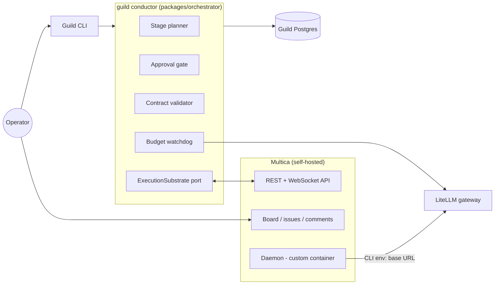
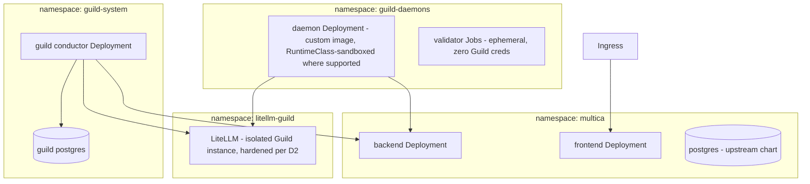

# Guild — Architecture

Status: **repositioned 2026-07-29** — Guild is now the autonomous-SDLC governance layer over a self-hosted Multica execution substrate (decision D8). Decision records D1–D7 are preserved below with their current status: four are superseded by the reposition, three are retained. Evidence: [VALIDATION-2026-07-29.md](VALIDATION-2026-07-29.md), [research/multica-comparison-2026-07-29.md](research/multica-comparison-2026-07-29.md), [research/multica-investigation-2026-07-29.md](research/multica-investigation-2026-07-29.md). The pre-reposition architecture is in git history.

## Overview

Component-by-component detail and every data/event flow (sequence diagrams, data-ownership table, trust boundaries): [OVERVIEW.md](OVERVIEW.md).



Guild is one service. It plans, gates, dispatches, validates, and enforces budget; Multica executes, displays, and routes conversations; the LiteLLM gateway meters every model call the agents make.

## Components

| Package | Responsibility |
|---|---|
| `packages/shared` | Published language: stage/plan/engagement types, `HandoffContract`, the `ExecutionSubstrate` port and its event types. Dependency-free. |
| `packages/orchestrator` | The Guild conductor: stage planner, approval gate, contract validator, budget watchdog. Hexagonal per D7 — Multica and LiteLLM live behind ports. |
| `packages/substrate-multica` | `ExecutionSubstrate` adapter over Multica's REST/WS API (PAT auth) — issues, assignment, comments, status/usage events. |
| `packages/substrate-conformance` | The reusable `ExecutionSubstrate` port contract suite (12 scenarios against the live stack) — mandatory-green on every Multica pin bump and daemon image rebuild. |
| `deploy/` | deployment options: compose (shipped at M1, accepted 2026-07-31) / optional generic K8s manifests at M4; secrets flow, storage rules. |
| `docker/daemon/` (M1) | The custom Multica daemon image Guild contributes (delivered at M1): `multica` binary, agent CLIs, git, headless token login, LiteLLM env routing. |

## Decision Records

### D8 — Multica as execution substrate (added 2026-07-29)

| Option | Pros | Cons |
|---|---|---|
| **Drive self-hosted Multica via its API** ✔ | Reuses a hardened board, 14+ runtime adapters, skills catalog, comment routing (verified deterministic), usage recording; 100% of Guild effort goes to the differentiated governance layer; context-freshness falls out of issue-per-engagement (verified session mechanics) | License is source-available with a vendor terms-change clause; agent/squad-management API surface unverified; daemon container unofficial (we build it) |
| Build own platform (original plan) | Full control, pure event-sourced design | Rebuilds ~60% of shipped, hardened Multica surface before any differentiator is testable — rejected on evidence, see comparison report |
| Backend-agnostic thin layer from day one | Hedges substrate risk | Abstraction without a second concrete substrate is speculation; the `ExecutionSubstrate` port already preserves this as the exit path |

**License constraints (normative):** personal self-hosting + a non-commercial open-source Guild driving its own instance's API sits inside Multica's internal-use carve-out (quoted and analyzed in [research/multica-investigation-2026-07-29.md](research/multica-investigation-2026-07-29.md) Q5; the root `LICENSE` here is Guild's own Apache-2.0, a separate thing). Guild must never: host Multica for third parties, embed it in anything sold, or rebrand its UI. Multica's license is **not** OSI open source and the vendor may tighten terms in future releases — pin the Multica version, review the LICENSE diff on every upgrade.

**Unknown-status policy (normative):** the port's status vocabulary is a closed union; a Multica status with no mapping surfaces as `unknown` — the conductor parks the engagement and raises `desync` — and is never silently mapped to the nearest neighbor. The conformance suite asserts the load-bearing behavioral facts on every pin bump, including that `dispatched → running` has **no intervening approval state**.

**Partial-native-landing ladder:** Multica's community is actively voting for native workflow structure (#815, #1943) — assume some of it ships. Response order: (1) keep driving the flat model and let the conformance suite detect behavioral change at the pin bump; (2) if a native gate/epic layer lands but is optional, stay flat and record the delta; (3) if the conformance assertion breaks (an intervening approval state appears), decide explicitly: adopt the native mechanism behind the port, or hold the pin — never absorb the change silently.

**Revisit if:** the license tightens against the carve-out; the API proves too thin for contracted dispatch or agent management (fall back to the backend-agnostic option via the port); or Multica ships native gates/contracts/budgets that make Guild's layer redundant.

### D1 — Inter-agent communication: NATS JetStream — **SUPERSEDED by D8**

Guild no longer operates an agent-to-agent bus: Multica owns agent coordination (task queue + deterministic comment routing, verified in source). Guild v2 is a single service consuming Multica's WebSocket stream; an internal bus is unjustifiable at this scale. The D1 analysis (NATS over Redis/Kafka; standards watch on MCP/A2A/AG-UI) remains valid history and the standards watch continues under D8's revisit clause. **Reinstate trigger:** Guild itself becomes multi-service with fan-out needs.

### D2 — Model access: LiteLLM gateway — **RETAINED, mechanism changed**

The gateway now sits behind the daemon image: agent CLIs inside the container are pointed at LiteLLM (`ANTHROPIC_BASE_URL` et al.), preserving per-role model policy, central spend metering, and the supply-chain rules from the original D2 (pin version + image digest; delayed scanned upgrades; hardened gateway container/pod). This is also what makes budget *enforcement* possible at all — verified in Multica's source: it records cost but enforces nothing, so the watchdog's data must come from Guild's own gateway. Feature-parity acceptance test (prompt caching, extended thinking through the proxy) carries over to M1.

### D3 — AgentRuntimeAdapter — **SUPERSEDED by D8, narrowed to the `ExecutionSubstrate` port**

Multica owns runtime adapters (14+ CLIs, exceeding our entire former roadmap). What survives is the *shape* of D3: one port, `ExecutionSubstrate`, owned by `packages/shared`, with `substrate-multica` as its first adapter. The port keeps Guild substrate-agnostic — the D8 fallback is "write a second adapter," not "rewrite Guild." Serializable handles, permission surfaces, and interrupts are now Multica's concern; Guild's port needs: create/assign/comment/cancel work items, watch events, read usage.

### D4 — Event streams as truth, Postgres projection — **SUPERSEDED by D8**

Guild's own state (plans, gates, contract verdicts, budget ledger) is a plain Postgres schema in one service — event sourcing an audit's worth of governance decisions through JetStream was justified for a platform, not for a conductor. The stream-retention/idempotency analysis remains valid history. Guild treats Multica's timeline as the execution audit trail and keeps its own append-only `decisions` table for governance provenance. **Reinstate trigger:** per old D4 revisit — if governance state accretes replay/timer/compensation needs, evaluate DBOS first (TypeScript-native, Postgres-only), not a bus.

### D5 — Next.js/SSE UI — **SUPERSEDED by D8**

Multica's board is the UI. Guild ships a CLI first; plan approval works through the CLI (and a bounded auto-approve timer), with blocker visibility read from the substrate stream. If Guild later grows its own thin approval UI, the old D5 analysis (SSE-first, AG-UI-aligned payloads) applies unchanged.

### D6 — Specification & handoff discipline — **RETAINED, now the core product**

Unchanged in substance, elevated in role: the plan-approval gate, machine-checkable handoff contracts, trace visibility, and single-writer discipline are no longer one decision among eight — they are the product. Concrete grounding added by the research: multica#1579 (trusted self-report failure) is the documented real-world case for contract validation; multica#815 and #1943 are the community demand for stages and gates. Contract mechanics:

- A `HandoffContract` = executable Gherkin acceptance criteria + concrete checks (command exit codes, artifact existence), authored by the upstream role *before* implementation.
- **Guild runs the validation** — never the implementing agent's session — and posts the verdict as a comment on the engagement issue. Self-reports are hostile input.
- Single-writer: one engagement = one Multica issue = one agent = one branch; merges are Guild-mediated.
- **Plan approval is explicit by default** — the bounded auto-approve timer is a per-project opt-in for actively supervised runs, never the default (external review 2026-07-30: silence-as-consent lets a flawed, expensive plan approve itself while a solo operator sleeps).

**Contract execution semantics (added 2026-07-30, external review; hardened same day, Anthropic review):**

- **The validator is itself least-trusted.** Contract checks execute agent-authored commands against agent-authored code — hostile input. Validation therefore runs as an **ephemeral sandbox from the daemon image** (a trust-table peer of the daemon): zero Guild credentials, no gateway master key, no Guild PG access, registry-only egress. The conductor's validator runner has two drivers with the same contract: a K8s Job (Kubernetes deployments) and a `docker run` container (Tier 1 compose). The conductor reads back exit codes and captured evidence and **writes the verdict itself** — the validator can fail the work; it can never sign for Guild.
- **Tier 1 driver mechanics (added 2026-07-30, reorganisation — decided before M1 builds the driver):** the `docker run` driver needs Docker API access from the conductor; a raw `/var/run/docker.sock` mount is host-root-equivalent and **forbidden** — the conductor reaches Docker only through a **scoped socket proxy** (allowlist: container create/start/attach/wait/logs/remove; deny exec, host-path volumes, privileged) on a dedicated compose network. **Documented Tier 1 deviation:** plain Docker cannot enforce the registry-only egress the Job driver gets from NetworkPolicies; the compose validator runs on a dedicated network with no route to Guild services, and its remaining internet egress is an accepted, documented residual risk (`deploy/README.md` security floor) unless/until the optional M4 lift is pursued.
- **Validation and merge are SHA-pinned.** The engagement branch head is resolved **once** when the agent reports done; that `commitSha` rides in the verdict; the validator checks out that SHA detached; the merge is fast-forward-only to exactly that SHA. An agent pushing after "done" moves the head — which produces a new report, never a re-judgment of the old one (closes the TOCTOU route back to multica#1579).
- Every command check runs from the clone root (or its declared repo-relative `cwd`) with a **mandatory timeout**; stdout/stderr are captured as evidence and referenced from the verdict.
- Outcomes are three-valued: **passed**, **failed** (acceptance failure → bounce), and **validator_error** (infrastructure fault → retry validation; the work is never bounced for the validator's own failure).
- Verdicts carry the engagement id, contract id + version, and the validated `commitSha` into the append-only `decisions` table (types: `packages/shared/src/contract.ts`).

**Bounce rules (normative):** contracts are **immutable once dispatched** — an amendment is a new engagement, not an edit; a bounce returns to the same agent + issue (Multica session resume delivers prior context plus the failing criteria); bounce spend draws from the same engagement budget; after **two bounces** the next failure escalates to the operator instead of re-dispatching (`MAX_BOUNCES` in `packages/shared/src/governance.ts`).

### D7 — Hexagonal + DDD, TDD/BDD — **RETAINED**

Unchanged. The reposition simplifies the context map: **Governance context** (`orchestrator`: Plan, Stage, Engagement, HandoffContract, BudgetLedger) and the substrate boundary (`substrate-multica` as an anti-corruption layer — Multica's issue/comment/status vocabulary is translated at the adapter, never leaking into the domain). `packages/shared` remains the published language. BDD doubles as product mechanism per D6. Normative rules in root `CLAUDE.md`.

### D9 — Default agent runtime: OpenCode via LiteLLM; API-key billing only (added 2026-07-30)

| Option | Pros | Cons |
|---|---|---|
| **OpenCode default + Claude Code supported, all traffic via LiteLLM API keys** ✔ | Provider-agnostic CLI (custom `baseURL`+`apiKey` providers, native OpenRouter) = any-model coverage through one gateway; MIT, active, pinnable npm install; no coupling of the default path to one provider's CLI or terms | Headless contract rougher than Claude Code's (gated by e2e proof, matrix P16); `provider/model`-qualified model IDs need a baked provider config |
| Claude Code default (M1a status quo) | Proven first (P3), richest headless contract | Default path coupled to one provider's CLI; any-model story depends entirely on Anthropic-format emulation at the gateway |
| Anthropic Max subscription auth for agents | No marginal token cost | **Rejected on policy, not economics**: Consumer Terms §3 ban automation except via API key; Claude Code legal page forbids routing through Pro/Max credentials; live enforcement precedent (OpenCode forced to strip it, Feb 2026). Also bypasses the gateway = no metering, no `max_budget` kill-switch. Operator's standing gate: "keep this app clean and legal." |

Rulings (operator, 2026-07-30; evidence in [research/agent-model-strategy-2026-07-30.md](research/agent-model-strategy-2026-07-30.md)):
**OpenCode is the default agent CLI**, bundled in the same daemon image (one container; Multica registers one runtime row per detected CLI). **Claude Code remains supported** and proven. **LiteLLM is the de-facto model proxy** — the simplicity default is OpenCode + LiteLLM, with any-model reach coming from gateway routes (Anthropic direct, OpenRouter for the rest), never from multiplying CLIs. **Guild agents never authenticate with consumer-subscription credentials.**

Hexagonal seam (D7 applied): the gateway is a driven adapter behind the `ModelGateway` port (`packages/shared/src/gateway.ts` — mint/revoke per-engagement keys, read spend); runtime+model selection per role is domain policy carried by the plan and mapped to substrate agent config in the adapter. Swapping LiteLLM, adding a CLI, or changing providers touches adapters only.

**Revisit if:** OpenCode's headless contract regresses at a pin bump (conformance suite catches it — fall back to Claude Code default without a design change), or Anthropic ships sanctioned automation terms for subscription plans.

## Engagement lifecycle

```
Planned → Gated(awaiting approval) → Dispatched → Working ⇄ Blocked(question) → Reported → Validated | Bounced → Accepted
Terminal: Accepted | Cancelled | Escalated (bounce limit → operator)
```

**Conductor runtime semantics (added 2026-07-30, Anthropic review — the design as a running system, not just a specification):**

- **Dispatch is a saga, not a call.** Dispatching an engagement is four effects across three systems (mint virtual key, create work item, assign, record state). The conductor persists a dispatch-intent row first, and every effect is guarded: `findWorkItem(engagementId)` before create (the engagement id is embedded in the work item as the idempotency marker), intent rows before any non-idempotent comment or cancel. A conductor crash mid-dispatch resumes the saga — it never re-dispatches blind.
- **Reconciliation is the truth path; the event stream is a latency optimization.** On every start and WS (re)connect the conductor reconciles engagement states against `listWorkItems`/`getWorkItem` reads; per-state liveness timeouts catch silent stalls. A missed event must never strand an engagement — `desync` is a category the reconciler resolves, not just a label.
- **Termination protocol.** Entering any terminal state (`accepted`, `cancelled`, `escalated`) revokes the engagement's virtual key and closes/locks the work item. Cancel-vs-done tiebreak: the conductor's first persisted decision wins; substrate events arriving after a terminal decision are logged and ignored (M1a probes whether replies on closed issues still enqueue agent tasks — if so, closing is mandatory, not hygiene).
- **Bounce continuity is best-effort, not guaranteed.** Session resume requires same agent + issue + workdir + non-poisoned session; a restart (container or pod) breaks it. Bounce comments are therefore **self-contained** (brief + verdict + failing criteria — enough to proceed context-fresh), and bounce-cost accounting assumes fresh context as the floor.

- **Context-fresh by construction:** one Multica issue per engagement; Multica's verified session mechanics (resume is scoped to the same agent+issue+workdir) mean a new issue always starts a fresh LLM context. Role continuity comes from role-memory artifacts composed into the engagement brief, never from accumulated conversation.
- **Bounced** work returns to the same issue (session resume gives the agent its prior context plus the failing criteria — the one place resume is desirable).
- Budget: the watchdog meters gateway spend per engagement; soft cap → warn, hard cap → cancel via substrate + stop dispatching. **Attribution mechanism (2026-07-30, external review — a container-wide base-URL env carries no engagement identity):** primary design is a **per-engagement LiteLLM virtual key minted at dispatch**; fallbacks are per-agent keys (role-level attribution) or header injection via a thin proxy. **M1 must prove one mechanism end to end before the watchdog is built** — until then the budget feature is unproven. **Insurance before the watchdog exists (restores the July-29 validation's M1-era cap):** every engagement key is minted with LiteLLM's native `max_budget` set to the engagement's cap — **converted at the adapter: `max_budget` is a dollar float, Guild's `budgetCents` is integer cents, so the LiteLLM adapter passes `budgetCents / 100`, never the raw cents value** — so the gateway itself stops serving at the cap even with zero watchdog code running; M1a proves the key actually stops at cap and how the resulting 429 classifies in Multica. The M2b watchdog adds soft-cap warnings, project-level aggregation (`ProjectBudget`), and key cleanup. Semantics: money is integer cents; caps trigger at `spent >= cap`; hard cap cancels in-flight work and locks dispatch; the gateway is the source of truth when telemetry lags (Multica `task_usage` is optional reconciliation only).

## Deployment topology (Docker Compose through M1–M3; the Kubernetes form below is the optional M4 lift — operator reorganisation 2026-07-30)

**Portability note (revised 2026-07-30, reorganisation):** the component/namespace/trust topology below is normative for any Kubernetes deployment (Tier 2 in `deploy/README.md`; the Docker-Compose Tier 1 runs the same components with validator sandboxes as `docker run` containers). Requirements here are strictly generic — FQDN egress control, runtime sandboxing, safe storage — provided where an environment supports them, or accepted as a documented residual risk. The author's concrete implementations (Cilium `toFQDNs`, gVisor via Talos, NFS classes, Flux) moved verbatim to the personal runbook (`runbooks/authors-cluster.md`), outside the product docs.



- Multica control plane via its upstream Helm chart (verified: backend/frontend/postgres/ingress only — no daemon template exists).
- **Daemon Deployment is Guild's contribution**: custom image (multica binary + agent CLIs + git — binary and CLI versions pinned as build args, CLI autoupdaters disabled; chart + image declared a lockstep pair), headless `multica login --token` from a Secret. Egress control is a deny-by-default policy with **FQDN-based allow rules for git hosts** where the CNI supports them (their IP ranges churn — a CIDR allowlist is forbidden as unmaintainable); git over HTTPS only; Multica backend and gateway by cluster identity. *(The author's Cilium `toFQDNs` + DNS-proxy implementation moved to the personal runbook, 2026-07-30.)*
- **The contract validator is a second least-trusted workload**: an ephemeral Job from the same daemon image, zero Guild credentials, registry-only egress (see D6) — the conductor reads its exit codes/evidence and writes the verdict itself.
- Provider keys live only in LiteLLM's secret; the daemon holds only its Multica token and git credentials.
- The end-to-end daemon container is **proven** (M1a probe P3, 2026-07-30: claim → completion → branch push; `docs/research/capability-matrix-m1a.md`). **Image scope: OpenCode (default, D9) + Claude Code** (amd64; credentials enter at runtime, never baked in); further runtimes are added per role when a role needs them.
- **Compose-era (M1–M3) hardening floor (raised 2026-07-30)**: segmented compose networks as trust zones (all databases `internal: true`; daemon and validator reach only the Multica backend + gateway), non-root containers, `cap_drop: ALL` + `no-new-privileges`, memory/pids limits on daemon and validator containers, no unnecessary host mounts, and a **fine-grained git PAT scoped to the product repo(s) only** — with the real blast-radius bounds being the explicit-approval default and gateway `max_budget` caps; the full residual-risk statement lives in `deploy/README.md`. **At the optional M4 lift, if pursued**: dedicated namespaces, the deny-by-default FQDN egress policies above, non-privileged service accounts with `automountServiceAccountToken: false`, PSA `restricted` labels, and the narrower `mdt_` daemon token where its scope suffices. *(Supersession note, 2026-07-30: the external-review disposition row "NetworkPolicies + least-privilege + PSA from M1" in `research/external-reviews-disposition.md` predates the compose-first sequencing and this reorganisation; the current answer to that security-review blocker is this floor plus the documented residual risks — the Kubernetes controls are optional-M4, possibly never. The frozen file itself is never edited.)*
- **Runtime sandboxing (generic):** RuntimeClass-based kernel sandboxing (gVisor/Kata) is recommended for daemon and validator pods where the platform supports it; on plain Docker, `runtime: runsc` is a documented option where the host has it — never a requirement. *(The author's gVisor-on-Talos node-image plan moved verbatim to the personal runbook, 2026-07-30.)*

## Open Questions

1. Multica's agent/squad **management** API surface (create/configure agents programmatically) — required for M3 hiring, unverified; resolve by probing the API against a local instance early in M1. **Fallback pre-declared (2026-07-30):** if runtime agent creation proves unusable, "dynamic hiring" means selecting from a pre-registered idle pool of role agents — same product outcome, known-supported registry mechanics.
2. Plan-approval UX: CLI-only vs. also mirroring the plan as a Multica issue the operator approves by comment. Decide in M2 (where the gate is built) from actual use.
3. ~~Where generated products live~~ — **resolved 2026-07-30 for MVP**: one git repository per project on the operator's GitHub (created at project start; M1's integration test uses a scratch repo); the daemon pushes engagement branches there. An in-cluster forge (e.g. Gitea) stays a documented fully-local alternative for later.
4. Whether Multica's usage/timeline API exposes enough per-task cost for the watchdog to cross-check the gateway numbers (nice-to-have reconciliation).
5. ~~Multica Postgres placement~~ — **reframed 2026-07-30 as a dual-mode requirement, not a choice**: the deploy supports and documents both in-cluster datastores (K8s Postgres instances with documented PVs) and external datastores (connection-string overrides, one DB/role per app, pgvector noted). Dev runs fully isolated ("test like a new user" — zero pre-existing services used). Both modes remain supported for other users; the author's own permanent-placement decision moved to the personal runbook (2026-07-30). The external mode gets its first real exercise at M4 (unconditional item).
6. ~~Final exposure~~ — **moved 2026-07-30 to the author's personal runbook** (`runbooks/authors-cluster.md`): a personal-cluster placement decision with no product content.
7. ~~Gateway topology at promotion~~ — **moved 2026-07-30 to the author's personal runbook**: fold-in vs. separate instance is an author-cluster decision; the product keeps the isolated-instance design (D2).
