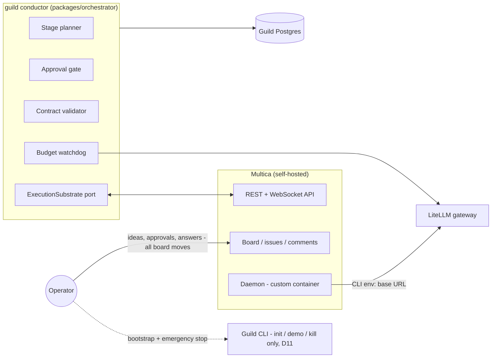
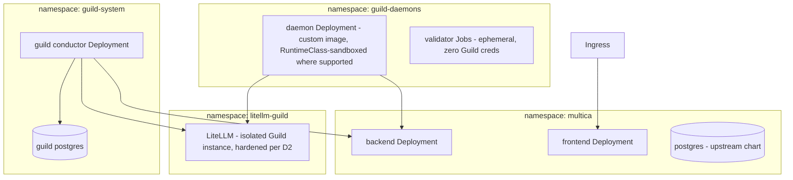

# Guild — Architecture

Status: **repositioned 2026-07-29** — Guild is now the autonomous-SDLC governance layer over a self-hosted Multica execution substrate (decision D8). Decision records D1–D7 are preserved below with their current status: four are superseded by the reposition, three are retained. Evidence: [VALIDATION-2026-07-29.md](VALIDATION-2026-07-29.md), [research/multica-comparison-2026-07-29.md](research/multica-comparison-2026-07-29.md), [research/multica-investigation-2026-07-29.md](research/multica-investigation-2026-07-29.md). The pre-reposition architecture is in git history.

## Overview

Component-by-component detail and every data/event flow (sequence diagrams, data-ownership table, trust boundaries): [OVERVIEW.md](OVERVIEW.md).



Guild is one service. It plans, gates, dispatches, validates, and enforces budget; Multica executes, displays, and routes conversations; the LiteLLM gateway meters every model call the agents make.

## Components

| Package | Responsibility |
|---|---|
| `packages/shared` | Published language: stage/plan/engagement types, `HandoffContract`, the `ExecutionSubstrate` port and its event types. Dependency-free. |
| `packages/orchestrator` | The Guild conductor: stage planner, approval gate, contract validator, budget watchdog. Hexagonal per D7 — Multica and LiteLLM live behind ports. |
| `packages/substrate-multica` | `ExecutionSubstrate` adapter over Multica's REST/WS API (PAT auth) — issues, assignment, comments, status/usage events. |
| `packages/substrate-conformance` | The reusable `ExecutionSubstrate` port contract suite (17 scenarios against the live stack) — mandatory-green on every Multica pin bump and daemon image rebuild. |
| `deploy/` | deployment options: compose (shipped at M1, accepted 2026-07-31) / optional generic K8s manifests at M4; secrets flow, storage rules. |
| `docker/daemon/` (M1) | The custom Multica daemon image Guild contributes (delivered at M1): `multica` binary, agent CLIs, git, headless token login, LiteLLM env routing. |

## Decision Records

### D8 — Multica as execution substrate (added 2026-07-29)

| Option | Pros | Cons |
|---|---|---|
| **Drive self-hosted Multica via its API** ✔ | Reuses a hardened board, 14+ runtime adapters, skills catalog, comment routing (verified deterministic), usage recording; 100% of Guild effort goes to the differentiated governance layer; context-freshness falls out of issue-per-engagement (verified session mechanics) | License is source-available with a vendor terms-change clause; agent/squad-management API surface unverified; daemon container unofficial (we build it) |
| Build own platform (original plan) | Full control, pure event-sourced design | Rebuilds ~60% of shipped, hardened Multica surface before any differentiator is testable — rejected on evidence, see comparison report |
| Backend-agnostic thin layer from day one | Hedges substrate risk | Abstraction without a second concrete substrate is speculation; the `ExecutionSubstrate` port already preserves this as the exit path |

**License constraints (normative):** personal self-hosting + a non-commercial open-source Guild driving its own instance's API sits inside Multica's internal-use carve-out (quoted and analyzed in [research/multica-investigation-2026-07-29.md](research/multica-investigation-2026-07-29.md) Q5; the root `LICENSE` here is Guild's own Apache-2.0, a separate thing). Guild must never: host Multica for third parties, embed it in anything sold, or rebrand its UI. Multica's license is **not** OSI open source and the vendor may tighten terms in future releases — pin the Multica version, review the LICENSE diff on every upgrade.

**Unknown-status policy (normative):** the port's status vocabulary is a closed union; a Multica status with no mapping surfaces as `unknown` — the conductor parks the engagement and raises `desync` — and is never silently mapped to the nearest neighbor. The conformance suite asserts the load-bearing behavioral facts on every pin bump, including that `dispatched → running` has **no intervening approval state**.

**Partial-native-landing ladder:** Multica's community is actively voting for native workflow structure (#815, #1943) — assume some of it ships. Response order: (1) keep driving the flat model and let the conformance suite detect behavioral change at the pin bump; (2) if a native gate/epic layer lands but is optional, stay flat and record the delta; (3) if the conformance assertion breaks (an intervening approval state appears), decide explicitly: adopt the native mechanism behind the port, or hold the pin — never absorb the change silently.

**Revisit if:** the license tightens against the carve-out; the API proves too thin for contracted dispatch or agent management (fall back to the backend-agnostic option via the port); or Multica ships native gates/contracts/budgets that make Guild's layer redundant.

### D1 — Inter-agent communication: NATS JetStream — **SUPERSEDED by D8**

Guild no longer operates an agent-to-agent bus: Multica owns agent coordination (task queue + deterministic comment routing, verified in source). Guild v2 is a single service consuming Multica's WebSocket stream; an internal bus is unjustifiable at this scale. The D1 analysis (NATS over Redis/Kafka; standards watch on MCP/A2A/AG-UI) remains valid history and the standards watch continues under D8's revisit clause. **Reinstate trigger:** Guild itself becomes multi-service with fan-out needs.

### D2 — Model access: LiteLLM gateway — **RETAINED, mechanism changed**

The gateway now sits behind the daemon image: agent CLIs inside the container are pointed at LiteLLM (OpenCode's baked provider config since the 2026-08-04 D9 amendment; `ANTHROPIC_BASE_URL` in the two-CLI era), preserving per-role model policy, central spend metering, and the supply-chain rules from the original D2 (pin version + image digest; delayed scanned upgrades; hardened gateway container/pod). This is also what makes budget *enforcement* possible at all — verified in Multica's source: it records cost but enforces nothing, so the watchdog's data must come from Guild's own gateway. Feature-parity acceptance test (prompt caching, extended thinking through the proxy) carries over to M1.

### D3 — AgentRuntimeAdapter — **SUPERSEDED by D8, narrowed to the `ExecutionSubstrate` port**

Multica owns runtime adapters (14+ CLIs, exceeding our entire former roadmap). What survives is the *shape* of D3: one port, `ExecutionSubstrate`, owned by `packages/shared`, with `substrate-multica` as its first adapter. The port keeps Guild substrate-agnostic — the D8 fallback is "write a second adapter," not "rewrite Guild." Serializable handles, permission surfaces, and interrupts are now Multica's concern; Guild's port needs: create/assign/comment/cancel work items, watch events, read usage.

### D4 — Event streams as truth, Postgres projection — **SUPERSEDED by D8**

Guild's own state (plans, gates, contract verdicts, budget ledger) is a plain Postgres schema in one service — event sourcing an audit's worth of governance decisions through JetStream was justified for a platform, not for a conductor. The stream-retention/idempotency analysis remains valid history. Guild treats Multica's timeline as the execution audit trail and keeps its own append-only `decisions` table for governance provenance. **Reinstate trigger:** per old D4 revisit — if governance state accretes replay/timer/compensation needs, evaluate DBOS first (TypeScript-native, Postgres-only), not a bus.

### D5 — Next.js/SSE UI — **SUPERSEDED by D8**

Multica's board is the UI. Guild ships a CLI first; plan approval works through the CLI (and a bounded auto-approve timer), with blocker visibility read from the substrate stream. If Guild later grows its own thin approval UI, the old D5 analysis (SSE-first, AG-UI-aligned payloads) applies unchanged. *(Approval surface revised 2026-08-02, D11: the board is the control surface — approval is an operator lane move; the CLI shrinks to bootstrap + kill-switch.)*

### D6 — Specification & handoff discipline — **RETAINED, now the core product**

Unchanged in substance, elevated in role: the plan-approval gate, machine-checkable handoff contracts, trace visibility, and single-writer discipline are no longer one decision among eight — they are the product. Concrete grounding added by the research: multica#1579 (trusted self-report failure) is the documented real-world case for contract validation; multica#815 and #1943 are the community demand for stages and gates. Contract mechanics:

- A `HandoffContract` = executable Gherkin acceptance criteria + concrete checks (command exit codes, artifact existence), authored by the upstream role *before* implementation.
- **Guild runs the validation** — never the implementing agent's session — and posts the verdict as a comment on the engagement issue. Self-reports are hostile input.
- Single-writer: one engagement = one Multica issue = one agent = one branch; merges are Guild-mediated.
- **Plan approval is explicit by default** — the bounded auto-approve timer is designed as a per-project opt-in for actively supervised runs, never the default, and is **not yet implemented** (the `auto_approved` decision type + read paths shipped without a producer — #23 E2; external review 2026-07-30: silence-as-consent lets a flawed, expensive plan approve itself while a solo operator sleeps).

**Contract execution semantics (added 2026-07-30, external review; hardened same day, Anthropic review):**

- **The validator is itself least-trusted.** Contract checks execute agent-authored commands against agent-authored code — hostile input. Validation therefore runs as an **ephemeral sandbox from the daemon image** (a trust-table peer of the daemon): zero Guild credentials, no gateway master key, no Guild PG access, registry-only egress. The conductor's validator runner has two drivers with the same contract: a K8s Job (Kubernetes deployments) and a `docker run` container (Tier 1 compose). The conductor reads back exit codes and captured evidence and **writes the verdict itself** — the validator can fail the work; it can never sign for Guild.
- **Tier 1 driver mechanics (added 2026-07-30, reorganisation — decided before M1 builds the driver):** the `docker run` driver needs Docker API access from the conductor; a raw `/var/run/docker.sock` mount is host-root-equivalent and **forbidden** — the conductor reaches Docker only through a **scoped socket proxy** (allowlist: container create/start/attach/wait/logs/remove; deny exec, host-path volumes, privileged) on a dedicated compose network. **Documented Tier 1 deviation:** plain Docker cannot enforce the registry-only egress the Job driver gets from NetworkPolicies; the compose validator runs on a dedicated network with no route to Guild services, and its remaining internet egress is an accepted, documented residual risk (`deploy/README.md` security floor) unless/until the optional M4 lift is pursued.
- **Validation and merge are SHA-pinned.** The engagement branch head is resolved **once** when the agent reports done; that `commitSha` rides in the verdict; the validator checks out that SHA detached; the merge is fast-forward-only to exactly that SHA. An agent pushing after "done" moves the head — which produces a new report, never a re-judgment of the old one (closes the TOCTOU route back to multica#1579).
- Every command check runs from the clone root (or its declared repo-relative `cwd`) with a **mandatory timeout**; stdout/stderr are captured as evidence and referenced from the verdict.
- Outcomes are three-valued: **passed**, **failed** (acceptance failure → bounce), and **validator_error** (infrastructure fault → retry validation; the work is never bounced for the validator's own failure).
- Verdicts carry the engagement id, contract id + version, and the validated `commitSha` into the append-only `decisions` table (types: `packages/shared/src/contract.ts`).

**Bounce rules (normative):** contracts are **immutable once dispatched** — an amendment is a new engagement, not an edit; a bounce returns to the same agent + issue (Multica session resume delivers prior context plus the failing criteria); bounce spend draws from the same engagement budget; after **two bounces** the next failure escalates to the operator instead of re-dispatching (`MAX_BOUNCES` in `packages/shared/src/governance.ts`).

### D7 — Hexagonal + DDD, TDD/BDD — **RETAINED**

Unchanged. The reposition simplifies the context map: **Governance context** (`orchestrator`: Plan, Stage, Engagement, HandoffContract, BudgetLedger) and the substrate boundary (`substrate-multica` as an anti-corruption layer — Multica's issue/comment/status vocabulary is translated at the adapter, never leaking into the domain). `packages/shared` remains the published language. BDD doubles as product mechanism per D6. Normative rules in root `CLAUDE.md`.

### D9 — Default agent runtime: OpenCode via LiteLLM; API-key billing only (added 2026-07-30)

| Option | Pros | Cons |
|---|---|---|
| **OpenCode default + Claude Code supported, all traffic via LiteLLM API keys** ✔ | Provider-agnostic CLI (custom `baseURL`+`apiKey` providers, native OpenRouter) = any-model coverage through one gateway; MIT, active, pinnable npm install; no coupling of the default path to one provider's CLI or terms | Headless contract rougher than Claude Code's (gated by e2e proof, matrix P16); `provider/model`-qualified model IDs need a baked provider config |
| Claude Code default (M1a status quo) | Proven first (P3), richest headless contract | Default path coupled to one provider's CLI; any-model story depends entirely on Anthropic-format emulation at the gateway |
| Anthropic Max subscription auth for agents | No marginal token cost | **Rejected on policy, not economics**: Consumer Terms §3 ban automation except via API key; Claude Code legal page forbids routing through Pro/Max credentials; live enforcement precedent (OpenCode forced to strip it, Feb 2026). Also bypasses the gateway = no metering, no `max_budget` kill-switch. Operator's standing gate: "keep this app clean and legal." |

Rulings (operator, 2026-07-30; evidence in [research/agent-model-strategy-2026-07-30.md](research/agent-model-strategy-2026-07-30.md)):
**OpenCode is the default agent CLI**, bundled in the same daemon image (one container; Multica registers one runtime row per detected CLI). **Claude Code remains supported** and proven. **LiteLLM is the de-facto model proxy** — the simplicity default is OpenCode + LiteLLM, with any-model reach coming from gateway routes (Anthropic direct, OpenRouter for the rest), never from multiplying CLIs. **Guild agents never authenticate with consumer-subscription credentials.**

Hexagonal seam (D7 applied): the gateway is a driven adapter behind the `ModelGateway` port (`packages/shared/src/gateway.ts` — mint/revoke per-engagement keys, read spend); runtime+model selection per role is domain policy carried by the plan and mapped to substrate agent config in the adapter. Swapping LiteLLM, adding a CLI, or changing providers touches adapters only.

**Revisit if:** OpenCode's headless contract regresses at a pin bump (conformance suite catches it — fall back to Claude Code default without a design change), or Anthropic ships sanctioned automation terms for subscription plans.

**Amendment (2026-08-04, operator decision session; supersedes "Claude Code remains supported"):**

| Option | Pros | Cons |
|---|---|---|
| **Drop Claude Code entirely — OpenCode via LiteLLM is the sole runtime** ✔ | Model reach was never Claude Code's job (gateway routes cover Anthropic models through OpenCode); one less pin; resolves the redistribution question on the public daemon image — `opencode-ai` is MIT while `@anthropic-ai/claude-code` (npm 2.1.221, verified 2026-08-04) ships "© Anthropic PBC. All rights reserved" | No pre-baked second runtime: an OpenCode headless regression at a pin bump is handled by pinning back + fixing forward (the conformance suite still detects it) |
| Drop from the published image, keep the build-arg | Clean redistribution story with a documented local-build fallback | Keeps the pin and a second image variant to document and test |
| Keep both (status quo ante) | Instant fallback | The fallback narrows to Anthropic-format models exactly when invoked; unverified proprietary-redistribution exposure on a public GHCR image (clean-and-legal gate); standing pin + image cost |

The fallback clause in the revisit line above is superseded accordingly. Implementation, license-terms verification, and disposition of the already-published `v0.1.0` image: issue #13.

### D10 — Multi-project mapping: one Multica workspace per Guild project (added 2026-08-02)

| Option | Pros | Cons |
|---|---|---|
| **One workspace per Guild project** ✔ | Hard isolation by construction — board, agents, and repo wiring are workspace-scoped (workspace-level attachment is the only repo mechanism that exists, P18); one board wall per project (composes with D11); workspace creation is API-automatable (`POST /api/workspaces`, `name`+`slug` required); **one daemon serves every workspace of its owner** (P17: runtime rows project into a newly created workspace with no restart, and task service there is live-proven) | More substrate objects per project (workspace, agents, runtime-row views); per-workspace provisioning code |
| Multica projects inside one workspace | Fewest substrate objects; single board | **Dead on evidence (P18)**: the project entity carries no repo surface (`GET /api/projects/{id}/repos` → 404; a `repos` field on `PUT` is silently dropped) — repo isolation collapses; every project shares one wall |
| Single workspace, defer multi-project | No work now | Multi-project is a spec requirement (#5), and the deciding probes were cheap and are already run — deferral buys nothing |

Normative consequences:

- `ExecutionSubstrate.projectScope` **is the Multica workspace id**; the conformance suite pins this meaning.
- Runtime rows are per-workspace views of the same physical daemon; agents bind to the row in their own workspace. **Daemon-per-project is an optional throughput/isolation lever, never a reachability requirement** (P17 refuted the scale-out fallback's necessity).
- Multica's "project" entity (a delivery grouping with `issue_count`/`done_count` rollups) is reserved as a candidate surface for **workstream grouping within a Guild project** (#8) — never for Guild-project isolation.
- Guild provisions the workspace at project creation and wires the project's repo(s) at workspace level; the per-project git credential (#6, repo-scoped tokens — operator decision 2026-08-02) attaches at this same seam when implemented.

Evidence: capability-matrix addendum 2026-08-02 (P17/P18). Decision trail: issue #5. **Revisit if:** Multica changes runtime projection across workspaces (conformance suite at pin bump), or per-workspace object count becomes an operational burden.

### D11 — The board is the control surface (added 2026-08-02)

Operator directive (2026-08-02, verbatim on issue #10): *"I don't want the AI to take any initiatives on its own. … Tickets are the sources of truth, of communication with agents and humans, and of triggers for the agents to continue or not."*

| Option | Pros | Cons |
|---|---|---|
| **Board as control surface — tickets are truth, communication, and trigger; CLI = bootstrap + kill-switch** ✔ | One interaction surface, decisions happen where the work is visible; the purest form of the directive; substrate-feasible on evidence (P20–P22: fixed status enum maps 1:1, every mutation pushes a WS frame, actor attribution is first-class) | The conductor must watch and attribute board changes (proven cheap: `issue:updated` + `activity:created` frames) |
| CLI-mediated approval (the original M2b plan) | Deterministic; no watcher needed for the gate | Two surfaces — board to see, terminal to act; daily CLI dependence; contradicts the directive |
| Dual surface (CLI mirrors every board action) | Flexibility | Two UXes to keep consistent; surface drift becomes its own bug class |

**Zero discretion, full mechanics (normative):** Guild never invents work, never changes scope, never self-approves. It only executes transitions that a human-approved plan already authorizes and that a validated contract permits. Corollaries: **nothing runs unless its ticket sits in a go lane**, and tickets reach go lanes only via explicit operator action or the approved plan's mechanics; **an agent moving its own ticket forward is ignored** — validation verdicts are the only forward path (multica#1579 discipline extended to the board); every Guild-made transition traces to the authorizing `planVersion` + contract verdict in the append-only `decisions` table.

**Lane projection (normative):** Multica issue statuses are a fixed, server-enforced enum (P20: `backlog, todo, in_progress, in_review, done, blocked, cancelled`). The six-lane board is Guild's projection onto it, and the conductor owns lane authority — nothing substrate-side auto-moves issue status, including task completion (P19):

| Lane | EngagementState(s) | Multica status |
|---|---|---|
| Backlog | Planned, Gated (stage plan not yet approved) | `backlog` |
| Ready to work | Dispatched, Bounced | `todo` |
| In progress | Working | `in_progress` |
| Waiting for feedback | Blocked, Validated (awaiting acceptance), Escalated | `blocked` |
| Ready for testing | Reported | `in_review` |
| Done | Accepted | `done` |
| — (terminal, off-board) | Cancelled | `cancelled` |

**Triggers and attribution (normative):** `issue:updated` frames (full before/after diff with per-field changed booleans) and `activity:created` entries (`actor_id` + `actor_type`, `details.from/to`) push every board change (P21/P22); reconciliation reads remain the truth path on start and reconnect (conductor runtime semantics, below). **Three distinct Multica member identities (D15, was two):** the **operator** (the human, whose lane moves are the approval/acceptance/halt signals), the **conductor** (its own PAT, hence a distinct `actor_id`, so a Guild move is never mistaken for a human one), and the **daemon** (`daemon@guild.local`, minted by `guild init` — the identity the LLM-running daemon container authenticates as). The daemon has its own identity precisely because its credential is agent-reachable; if it shared the operator's identity, a forged board move would read as an operator action (audit #17 A5d). **Attribution is an explicit allowlist, not "any non-conductor member":** the conductor attributes a member move as `operator` only if its `actor_id` is on `GUILD_OPERATOR_MEMBER_IDS`; every other member — the daemon included — reads as `unknown` and is never a forward signal (the closed-union policy of D8, restored). `actorFrom` is the single choke point for all four attribution surfaces. The startup assertion and `guild doctor` keep the three identities distinct and the daemon off the allowlist; agent-authored changes carry `actor_type`/`author_type`/`source_task_id`. The idempotent-echo rule (the conductor knows what it wrote) stays as belt-and-braces.

**Interaction grammar (normative):**

- **Idea entry — the idea is a ticket.** The operator writes the idea as a board ticket; the conductor recognizes operator-authored tickets carrying no engagement marker and answers with a plan ticket. There is no `guild idea` verb.
- **Plan approval:** the plan ticket waits in Waiting for feedback; the operator's lane move to Ready to work — a human-actor `status_changed` activity — **is** the explicit approval. The conductor records the `GateDecision`, moves the plan ticket to Done, and dispatches the stage's engagement tickets per the approved plan. D6's explicit-by-default rule is unchanged; the bounded auto-approve timer stays a per-project opt-in in design — still unimplemented (#23 E2).
- **Stage acceptance:** validated work waits in Waiting for feedback; the operator's move to Done is the acceptance.
- **Questions:** a blocker moves the engagement ticket to Waiting for feedback; the operator answers in ticket comments (Multica's verified routing delivers the reply to the asking agent with session continuity); the conductor returns the ticket to work.
- **CLI scope:** `guild init`, `guild doctor`, and the emergency kill-switch. Nothing else.

Resolves Open Question 2. Supersedes the CLI-approval mechanism noted under D5. Evidence: capability-matrix addendum 2026-08-02 (P19–P22). Decision trail: issue #10. **Revisit if:** the status enum changes at a pin bump (conformance suite asserts the mapping), or Multica ships native gates (D8's partial-native-landing ladder governs).

### D12 — The planner is a deterministic stage-template pipeline (added 2026-08-03, M2b design pass)

| Option | Pros | Cons |
|---|---|---|
| **Deterministic template planner — fixed five-stage pipeline over the fixed four-role starter team** ✔ | Zero discretion by construction (D11): every number and word in a proposed plan traces to the idea text, the amendment note, or configuration — Guild proposes only what the template mechanics derive; plans are reproducible, hence acceptance-testable; zero planner spend before the first gate | Plans are generic until M3 (role memory, dynamic hiring) adds tailoring |
| LLM-drafted plans | Tailored decomposition | Nondeterministic acceptance; token spend before any gate exists; a discretion surface exactly where D11 forbids one. Deferred: an operator-gated enhancement candidate at M3+, never the M2 base |
| No planner (operator hand-authors StagePlans) | Simplest | Fails PRODUCT flow 1 — "idea → staged plan" *is* the product |

Normative consequences:

- **Pipeline and team are fixed in v1:** analysis → architecture → implementation → test → delivery; roles analyst, architect, implementer, tester (delivery runs on the implementer — release chores are implementation work). The template emits **one engagement per stage**; the conductor's orchestration is N-engagement-per-stage capable (a `StagePlan` already carries a list) — the constraint is the template's, not the machinery's.
- **Budget allocation is mechanical:** the plan budget is a `budget:` directive in the idea body (dollars, converted to integer cents at parse — published-language money rules; the directive must be its own line, optionally after the `amend:` marker — prose that merely ends in a budget-looking phrase never reprices, #23 C4) or the configured default; stages split it by fixed integer-cent ratios (analysis 15% · architecture 15% · implementation 40% · test 20% · delivery 10%, remainder cents to implementation). Engagement `budgetCents` mints the virtual-key cap at dispatch (D2 unchanged). A stage whose split rounds to **0¢** (a `budget: 0` directive, or a sub-~10¢ plan total starving the small stages) can never dispatch — it emits a gate-body warning so the operator raises the directive rather than facing a silently stuck stage (#17 C1/C2). **Parsed directives clamp to a $100 per-directive sanity ceiling** (`MAX_PLAN_BUDGET_CENTS`, operator decision 2026-08-11, #12) with a gate-body warning — a typo guard, not an authority bound: the configured `GUILD_PLAN_BUDGET_CENTS` default passes through untouched, and five deliberate per-stage `amend: budget:` overrides can still authorize 5×, each behind its own explicit gate approval.
- **Contract assembly applies D6 to the planner era:** a stage's contract = Guild's per-stage-kind **floor checks** ∪ **upstream-authored checks** read from the preceding stage's validated SHA at `guild/handoff/<stageKind>.checks.json` (shape-validated: `{gherkin?, checks[]}`, ≤ 8 checks, per-check timeout ≤ 600 s; missing or invalid → floor-only plus a warning rendered in the gate body). The gate body renders the assembled contract in full — **operator approval covers contract content**. `authoredBy` names the upstream role when augmented; analysis contracts are authored by `operator` (the idea is the upstream artifact). Checks remain hostile input executed only in the least-trusted validator sandbox; floor checks must be **offline-capable** (the Tier 1 validator has no registry egress: `node --test`-class commands and artifact checks — a floor check must never require dependency installation).
- **Stage sequencing:** stage *k* is finalized (its contract assembly needs *k−1*'s validated SHA) and gate-posted only after every stage *k−1* engagement is accepted. Per-stage gate tickets keep the `gate:<stageId>:v<n>` marker; `planVersion` stays per-stage.
- **Amendment re-gates (D6 mirrored):** an operator comment starting `amend:` on a gate ticket awaiting approval appends the `amended` GateDecision, and the planner re-derives that stage from the **current** idea body plus the note (note text folds into the stage objective; a `budget:` directive in the note re-allocates), bumps `planVersion`, moves the old gate ticket off-board, posts the new one. Rejection (operator moves the gate ticket off-board) stays terminal for the plan — revision-before-approval is the amendment path; a new idea is a new ticket.
- **Idea detection (D11 grammar made mechanical):** an idea is an operator-authored ticket — creator attribution per P24/P25: issue `creator_id` against the conductor's own `/api/me` id, agent creator types excluded — carrying no Guild marker and not yet answered (no plan run recorded). Live trigger: the `item_created` substrate event; reconciliation: `listWorkItems` + creator/marker/plan-run filter — reads stay the truth path. The conductor answers by persisting the plan and posting stage 1's gate; it comments the plan reference on the idea ticket, never moves an operator's ticket mid-flight, and moves the idea ticket to Done only when the final stage is accepted. New issues default to the ready-to-work lane (P24) — inert for ideas: the **marker discipline, not the lane,** makes a ticket an engagement.
- **Plans are persisted at post time** (keyed stage + planVersion, plus a plan-run row: idea ref → ordered stages → status): recovery re-reads posted plans; it never re-derives content whose inputs (validated SHAs, amendment notes) have moved on.
- **Downtime amendments recover (#12):** reconciliation consults a `listComments` substrate read on the current gate ticket — operator-attributed `amend:` notes posted while the conductor was down apply oldest-first through the same mechanism as live amendments (first-writer-wins per plan version makes replays no-ops; attribution rides the same fail-closed `actorFrom` as the live event path, so an unattributable comment recovers nothing). An amendment beats a downtime go-lane (operator decision 2026-08-11, extending D15 (c)): the re-gate posts v+1 in waiting-for-feedback and the stale move dies with the superseded ticket. Project-cap notices also fan out to every active run's idea ticket, and the final spend reading is persisted on the engagement record before key revocation so a crash can never lose it (both #12).
- **Watchdog concretes** (implements the runtime-semantics budget paragraph below): engagement soft cap = configured ratio (default 80%) of `budgetCents` → one warning comment on the engagement ticket, deduped through the trail; the project is the workspace (D10) and project spend = Σ gateway spend across the store's engagements, `ProjectBudget` from configuration; hard cap → cancel every in-flight engagement (`budget_hard_cap`), persist a **dispatch lock** the saga checks before minting, comment the explanation on the active gate (or idea) ticket, append the `hard_cap` budget decision. The lock records the hard cap in force when set; the sweep clears it only when the configured hard cap is raised **above** that recorded value (raise-the-cap-and-restart, itself trail-recorded) — uniform across the budget lock and the kill switch (**D14**), no new CLI verb (D11 scope holds). The decision trail gains a `budget` entry kind.
- **Concurrency discipline (#11 CAS items land here):** one in-process async mutex serializes event handling, reconciliation, and watchdog sweeps; the store adds optimistic concurrency on engagement saves (shipped as a state-column compare-and-swap — `WHERE … AND state = <expected>`; the originally-described monotonic revision counter, which would also catch the ABA/same-state rewrites the state CAS admits, remains deferred past the #12 robustness pass — #12 instead pinned the shipped CAS semantics in a shared store-contract suite both adapters run; revisit the counter with the first concurrent-conductor need (#23 E3)) and first-writer-wins uniqueness on gate decisions per (stageId, planVersion) — cross-process safety established **before** any concurrent-conductor topology exists.

Evidence: capability-matrix addendum 2026-08-03 (P24/P25). **Revisit if:** M3's role memory and dynamic hiring make an LLM-assisted planner worth an operator-gated design pass, or multi-engagement stages become a real template need.

**Amendment (2026-08-04, operator decision session — the template revisit answered for M3):**

| Option | Pros | Cons |
|---|---|---|
| **Template catalog + `template:` directive** ✔ | Determinism and zero discretion survive — the catalog is fixed data and the choice is the operator's one-word directive in the idea body (same parse discipline as `budget:`, default `standard`); overkill is impossible by default; richer shapes become expressible (e.g. `enterprise`: business analysis → technical analysis → architecture+security → implementation → test → delivery; `quick-fix`: implementation → test) | Catalog curation is a new data surface (rides M3's role-template registry) |
| LLM-drafted decomposition | Maximum tailoring | Still rejected on this record's original grounds (nondeterministic acceptance, pre-gate spend, a discretion surface). An LLM *suggesting which catalog entry fits* — suggestion only, the plan stays deterministic — is a recorded M3+ candidate |
| Keep the single fixed template | Zero work | The enterprise scenario stays inexpressible; the revisit trigger stays unanswered |

Big-idea splitting (the companion decision, same day, recorded on issue #8): a business-plan-sized idea starts with a small gated **scoping delivery** whose contracted artifact *is* the proposed milestone list; operator ratification posts each milestone as its own grouped, sequenced idea (grouping via D10's reserved Multica project entity; milestone *k+1* opens only after *k*'s delivery is accepted), each with its own pipeline template. A `milestones:` directive covers the operator-already-knows case — same machinery, two feeds. M3+ scope.

### D13 — Agent rules: layered storage, the project charter, and rule-file maintenance (added 2026-08-04, operator decision session)

| Option | Pros | Cons |
|---|---|---|
| **Hybrid: global role templates as registry data; per-project rules as a repo file** ✔ | Each layer in its natural home — role defaults structured and queryable in the M3 role-template registry; project ways-of-working versioned, diffable, and PR-reviewable in the project's own git history; D6-compatible (everything still composes into the brief at dispatch) | Two mechanisms to maintain |
| Files everywhere (global default file + per-project override) | The familiar CLAUDE.md model, fully hand-editable | Global-layer changes aren't gated or queryable; merging two prose files is fuzzier than template + additions |
| Registry data only | Fully gated and trail-recorded | Rules invisible outside Guild — no repo diff, no PR review of a rules change |

Normative consequences:

- **Global layer:** role templates in the M3 role-template registry (existing roadmap bullet) carry each role's instructions and context as data — this replaces the v1 hardcoded `roleContext` in the planner.
- **Project layer:** one AGENTS.md-style rules file in the project repo; the planner reads it at the validated SHA (the D12 handoff-checks mechanism) and folds it into every brief — D6's "briefs carry everything" is unchanged.
- **Setup surface — the project charter ticket (D11 grammar extended):** at project creation the operator authors a charter ticket holding the rules text and any custom role requests; the conductor persists it and materializes the repo rules file through the normal gated mechanics. Board-mediated: no new UI, no new CLI verb.
- **Custom roles:** the charter may request roles beyond the starter four from the registry. A **focus-monitor role template ships opt-in** with observe-and-flag-only powers — zero discretion (D11) holds: a monitor never moves tickets or redirects work; deterministic contract validation remains the enforcement mechanism (self-reports stay untrusted). The monitor adds early *soft-drift observation* at visible, budgeted engagement cost — projects that want the extra eyes pay for them.
- **Maintenance — optimization is an idea ticket:** improving the default or per-project rules file is an ordinary governed delivery (e.g. `template: quick-fix`): an agent proposes the rewrite as a diff, the contract validates shape, the operator reviews/amends/accepts at the gate. Documented as a recipe; D11's CLI scope is unchanged.

Decision trail: issue #4 (M3 scope comment, 2026-08-04). **Revisit if:** the M3 registry design pass finds the charter ticket insufficient for role parameterization, or per-project rule files grow beyond what brief composition can reasonably carry.

### D14 — Dispatch-lock recovery is cap-at-lock, uniform across the budget halt and the kill switch (added 2026-08-05, audit #17 A1 fix)

The dispatch lock (D12 watchdog + D11 kill switch) records the project hard cap in force when it is set (`capCents`); the budget sweep clears it only when the running conductor's configured hard cap is raised **above** that recorded value — a genuine raise-the-cap-and-restart. Spend below the cap never releases a lock. This closes the audit-#17 A1 finding: `guild kill` fires while spend is below the cap (the normal case), so the previous `spent < cap` release cleared the kill lock on the very next sweep tick.

| Option | Pros | Cons |
|---|---|---|
| **Cap-at-lock, uniform (release iff configured cap > cap-at-lock)** ✔ | One rule covers the budget halt and the kill switch; "raise the caps and restart" (the message `guild kill` already prints) is literally the release trigger; no new CLI verb (D11 holds); more correct than spend-comparison — a terminated-key spend reading that dips below the cap can't spring the lock | The lock carries one extra integer, and the cap must be sourced from a value the RUNNING conductor and `guild kill` agree on (solved below) |
| Reason-prefix guard: the sweep simply never releases a `kill_switch` lock | Smallest diff | Leaves the kill lock with no config-driven recovery at all — contradicts the documented "raise the caps and restart", forcing a manual DB row delete or a new CLI verb D11 forbids |
| "Zero-cent cap" (the pre-fix documented framing) | No lock-shape change | Never actually implemented — and with the old `spent < cap` release reading the conductor's live config cap (not a per-lock cap), the kill lock still self-releases: this *is* the A1 bug |

Normative consequences:

- The `setDispatchLock` port carries an optional `capCents`; the pg adapter adds a nullable `cap_cents` column (idempotent `ADD COLUMN IF NOT EXISTS`).
- **The cap is the RUNNING conductor's, not the killer's env.** `guild kill` is a separate process whose `.env` may have drifted from the live conductor's frozen config (edited but not restarted). If the killer stamped a *lower* cap than the conductor is actually enforcing, that conductor's next sweep would see `configCap > lockCap` and self-release the kill lock with no operator raise — the A1 bug in a new guise (audit #17 verify pass). So the conductor persists its enforced hard cap at startup (`conductor_runtime.enforced_hard_cap_cents`), and `emergencyStop` stamps the lock from that persisted value (falling back to in-process config only for unit tests). Both processes then agree on the cap, which also makes the lock's UPSERT race harmless (either writer records the same value).
- With no project budget configured, no enforced cap is persisted and the kill lock carries no cap: it is never sweep-released, and `guild kill` says so explicitly rather than printing raise-and-restart guidance that cannot work.

Decision trail: issue #17 (A1). **Revisit if:** a concurrent-conductor topology needs the lock to also carry the acting identity, or a first-class `guild resume` verb is ever admitted to D11's CLI scope.

### D15 — Reconcile attribution: the truth path must know who moved a lane (added 2026-08-05, audit #17 A5)

The live event path guards every forward move with `ev.actor === "operator"` (agent and conductor moves are never forward signals, D11). Reconcile reads **snapshots** — which carry no actor — and acted on the lane alone, so unattributed board state could stand in for an operator approval/acceptance (audit #17 A5). Two vectors are closed in code now (A5a/A5b); the remaining two were gated on a substrate-capability question that the 2026-08-05 attribution probe has now answered (see *Probe outcome* below).

**Fixed (this record's shipped consequences):**
- **A5a — marker binding constrained to conductor authorship:** `findWorkItem` now matches only issues the conductor created (P25 `creator_id`). A planted issue carrying a derivable `gate:…`/engagement marker can no longer be adopted as the real ticket. Guild only ever looks up items it authored, so this is loss-free.
- **A5b — interrupted-post completion:** `gate_posted` is recorded only *after* a gate's resting-lane set, so its absence means the gate is still in the substrate's `ready_to_work` creation default (a crash between create and the initial set). `postGate` now re-asserts `waiting_for_feedback` and records the post when `gate_posted` is absent — a genuine operator approval always follows a *completed* post, so this never clobbers a real go-signal.

**Open — reframed by the 2026-08-05 probe (research addendum P26–P29; private advisory `GHSA-7pg8-mmpv-r6pc`):**
- **A5c — reconcile derives forward transitions from lane state with no actor check.** `conductor.ts:1087` (reconcile-accept of a `done` lane) *and* `conductor.ts:1033` (reconcile gate-approval of a `ready_to_work` lane — the money-spending path) read `WorkItemSnapshot`, which carries no actor (`packages/shared/src/substrate.ts`). Reachable with **no identity forgery at all** — any writer that can set the lane reaches them.
- **A5d — the daemon credential *is* the operator identity; `actorFrom` maps every non-conductor member to `operator`.** `MULTICA_DAEMON_TOKEN` and `GUILD_OPERATOR_TOKEN` are distinct token strings that both resolve (via `/api/me`) to `operator@guild.local`, and `translation.ts:71` maps `member && actorId !== selfMemberId → "operator"` — inverting this module's own closed-union policy to *most-privileged*. A board move authored with the agent-reachable daemon credential therefore passes the live guard `conductor.ts:517` as well as reconcile. Confirmed root cause of the family.
- **A5e — idea injection (new, same root).** `maybeAdoptIdea` (`conductor.ts:359`) gates on `snap.createdBy !== "operator"` through the same `actorFrom`, so a forged creator starts the whole plan pipeline.

**Probe outcome (resolves the reachability caveat this record was filed under):** the caveat — *"whether Multica lets an agent change an issue's status, as opposed to a task-run's, is unconfirmed; if it cannot, A5c/A5d are unreachable"* — is **answered against us**. Non-operators can move an issue's lane, including to `done`, with no server-side actor-type ceiling (P29); and the daemon credential resolving to the operator makes such a move attribute as an operator action (P28 + deployment fact). Impact is a **"zero un-contracted advances" violation** — forged gate-approval mints budget-capped keys and dispatches un-approved work; forged acceptance fast-forwards the validated SHA. The kill switch and overspend halt are **not** defeated (`dispatch()` is lock-gated, `conductor.ts:675`), and this grants no code-integrity reach the daemon's git token lacks (it already pushes to `main`) — so the sharp, novel harm is governance integrity + un-approved spend, not arbitrary code on `main`.

| Option | Pros | Cons |
|---|---|---|
| **Option 4 — partitioned identity + operator allowlist + conservative reconcile (all three; each a no-op alone)** ✔ (target, chosen with the operator 2026-08-06) | Closes both the live path and reconcile; `actorFrom` is the single choke point for all four attribution surfaces (`events.ts:79/:107/:120`, `snapshot.ts:54`), so it also closes A5e; restores the declared closed-union policy; no dependence on an undelivered substrate capability | Touches provisioning (`guild init` mints a `daemon@guild.local` identity), the `actorFrom` signature (adds an operator allowlist), and reconcile; a fail-closed allowlist also gates board cancel/reject (same `conductor.ts:517` guard), so it needs a startup assertion + `guild doctor` check + a warn log on every dropped member move; existing installs re-mint the daemon token and re-run `guild init` |
| Option 1 — read lane-change attribution during reconcile (`GET /api/issues/{id}/timeline`) | The endpoint exists and the reconcile identity can read it (P26) | **Not deliverable on this endpoint (P27):** it cannot return "who moved this lane last" — sort is `(created_at ASC, id ASC)` with second-resolution timestamps + UUIDv4 ids (intra-second order random) and `LIMIT` silently drops the newest rows; and a forged move and a genuine operator move are byte-identical rows, so attribution alone can't separate them. **Revisit** only if Multica ships working keyset pagination + sub-second ordering |
| Option 2 — conservative reconcile as a standalone fix | No new capability needed; fail-closed | Incomplete alone: as originally written it dropped only reconcile-accept and left the gate-approval (spend) path open. Folded into Option 4 as component (c), scope-widened to `conductor.ts:1033` + `:1087`, its "degraded recovery" con reduced to one operator gesture via a `setEngagementLane` re-assert to `waiting_for_feedback` (`conductor.ts:1196`) |
| Trust lane state (status quo) | — | The A5c/A5d/A5e self-approval residual — rejected |

Decision trail: issue #17 (A5); probe evidence in `docs/research/capability-matrix-m1a.md` P26–P29 and advisory `GHSA-7pg8-mmpv-r6pc`. **Chosen: Option 4.** Implementation is a separate red-first session — it changes behavior, so the same MR revises D11's "Triggers and attribution" paragraph from a two-identity to a three-identity model (operator / conductor / daemon) and the `BoardActor` doc comment, and corrects the stale `SECURITY.md` "pre-`v0.1.0`" line. **#17 stays open until that ships** as a `v0.1.1` patch.

## Engagement lifecycle

```
Planned → Gated(awaiting approval) → Dispatched → Working ⇄ Blocked(question) → Reported → Validated | Bounced → Accepted
Terminal: Accepted | Cancelled | Escalated (bounce limit → operator)
```

The board projection of these states — six lanes over Multica's fixed status enum, with the conductor as sole lane authority — is normative in D11.

**Conductor runtime semantics (added 2026-07-30, Anthropic review — the design as a running system, not just a specification):**

- **Dispatch is a saga, not a call.** Dispatching an engagement is four effects across three systems (mint virtual key, create work item, assign, record state). The conductor persists a dispatch-intent row first, and every effect is guarded: `findWorkItem(engagementId)` before create (the engagement id is embedded in the work item as the idempotency marker), intent rows before any non-idempotent comment or cancel. A conductor crash mid-dispatch resumes the saga — it never re-dispatches blind.
- **Reconciliation is the truth path; the event stream is a latency optimization.** On every start and WS (re)connect the conductor reconciles engagement states against `listWorkItems`/`getWorkItem` reads; per-state liveness timeouts catch silent stalls. A missed event must never strand an engagement — `desync` is a category the reconciler resolves, not just a label. Each item reconciles under isolation: a permanent fault on one (e.g. a human pushed to `main` so a validated engagement can't fast-forward) is collected and the pass continues, then re-raised as one aggregate so the fault stays visible without freezing every other engagement (#17 B2). **Conservative-reconcile exception (D15, normative):** a forward advance that *spends or fast-forwards* — gate approval and stage acceptance — is **never** derived from lane state during reconcile, because a snapshot carries no actor and a go-lane could be an agent-authored or forged move (#17 A5c). A go-lane observed on reconcile is re-asserted to its resting lane (`waiting_for_feedback`), so the operator re-issues the move on the live, attribution-carrying event path. **Attribution gates advances only, never halts:** rejection and cancellation are still honored on reconcile (fail-safe direction).
- **Termination protocol.** Entering any terminal state (`accepted`, `cancelled`, `escalated`) revokes the engagement's virtual key and closes/locks the work item. Cancel-vs-done tiebreak: the conductor's first persisted decision wins; substrate events arriving after a terminal decision are logged and ignored (M1a probes whether replies on closed issues still enqueue agent tasks — if so, closing is mandatory, not hygiene).
- **Bounce continuity is best-effort, not guaranteed.** Session resume requires same agent + issue + workdir + non-poisoned session; a restart (container or pod) breaks it. Bounce comments are therefore **self-contained** (brief + verdict + failing criteria — enough to proceed context-fresh), and bounce-cost accounting assumes fresh context as the floor.

- **Context-fresh by construction:** one Multica issue per engagement; Multica's verified session mechanics (resume is scoped to the same agent+issue+workdir) mean a new issue always starts a fresh LLM context. Role continuity comes from role-memory artifacts composed into the engagement brief, never from accumulated conversation.
- **Bounced** work returns to the same issue (session resume gives the agent its prior context plus the failing criteria — the one place resume is desirable).
- Budget: the watchdog meters gateway spend per engagement; soft cap → warn, hard cap → cancel via substrate + stop dispatching. **Attribution mechanism (2026-07-30, external review — a container-wide base-URL env carries no engagement identity):** primary design is a **per-engagement LiteLLM virtual key minted at dispatch**; fallbacks are per-agent keys (role-level attribution) or header injection via a thin proxy. **M1 must prove one mechanism end to end before the watchdog is built** — until then the budget feature is unproven. **Insurance before the watchdog exists (restores the July-29 validation's M1-era cap):** every engagement key is minted with LiteLLM's native `max_budget` set to the engagement's cap — **converted at the adapter: `max_budget` is a dollar float, Guild's `budgetCents` is integer cents, so the LiteLLM adapter passes `budgetCents / 100`, never the raw cents value** — so the gateway itself stops serving at the cap even with zero watchdog code running; M1a proves the key actually stops at cap and how the resulting 429 classifies in Multica. The M2b watchdog adds soft-cap warnings, project-level aggregation (`ProjectBudget`), and key cleanup. Semantics: money is integer cents; caps trigger at `spent >= cap`; hard cap cancels in-flight work and locks dispatch; the gateway is the source of truth when telemetry lags (Multica `task_usage` is optional reconciliation only).

## Deployment topology (Docker Compose through M1–M3; the Kubernetes form below is the optional M4 lift — operator reorganisation 2026-07-30)

**Portability note (revised 2026-07-30, reorganisation):** the component/namespace/trust topology below is normative for any Kubernetes deployment (Tier 2 in `deploy/README.md`; the Docker-Compose Tier 1 runs the same components with validator sandboxes as `docker run` containers). Requirements here are strictly generic — FQDN egress control, runtime sandboxing, safe storage — provided where an environment supports them, or accepted as a documented residual risk. The author's concrete implementations (Cilium `toFQDNs`, gVisor via Talos, NFS classes, Flux) moved verbatim to the personal runbook (`runbooks/authors-cluster.md`), outside the product docs.



- Multica control plane via its upstream Helm chart (verified: backend/frontend/postgres/ingress only — no daemon template exists).
- **Daemon Deployment is Guild's contribution**: custom image (multica binary + agent CLIs + git — binary and CLI versions pinned as build args, CLI autoupdaters disabled; chart + image declared a lockstep pair), headless `multica login --token` from a Secret. Egress control is a deny-by-default policy with **FQDN-based allow rules for git hosts** where the CNI supports them (their IP ranges churn — a CIDR allowlist is forbidden as unmaintainable); git over HTTPS only; Multica backend and gateway by cluster identity. *(The author's Cilium `toFQDNs` + DNS-proxy implementation moved to the personal runbook, 2026-07-30.)*
- **The contract validator is a second least-trusted workload**: an ephemeral Job from the same daemon image, zero Guild credentials, registry-only egress (see D6) — the conductor reads its exit codes/evidence and writes the verdict itself.
- Provider keys live only in LiteLLM's secret; the daemon holds only its Multica token and git credentials.
- The end-to-end daemon container is **proven** (M1a probe P3, 2026-07-30: claim → completion → branch push; `docs/research/capability-matrix-m1a.md`). **Image scope: OpenCode only** (the sole runtime, D9 as amended 2026-08-04; amd64; credentials enter at runtime, never baked in); further runtimes are added per role when a role needs them.
- **Compose-era (M1–M3) hardening floor (raised 2026-07-30)**: segmented compose networks as trust zones (no database publishes a host port — the M1–M2a dev-era guild-postgres loopback publish closed when the conductor shipped as a compose service at M2b; the host-side dev harness re-adds it only via the explicit `docker-compose.dev.yml` override; daemon and validator reach only the Multica backend + gateway), non-root containers, `cap_drop: ALL` + `no-new-privileges`, memory/pids limits on daemon and validator containers, no unnecessary host mounts, and a **fine-grained git PAT scoped to the product repo(s) only** — with the real blast-radius bounds being the explicit-approval default and gateway `max_budget` caps; the full residual-risk statement lives in `deploy/README.md`. **At the optional M4 lift, if pursued**: dedicated namespaces, the deny-by-default FQDN egress policies above, non-privileged service accounts with `automountServiceAccountToken: false`, PSA `restricted` labels, and the narrower `mdt_` daemon token where its scope suffices. *(Supersession note, 2026-07-30: the external-review disposition row "NetworkPolicies + least-privilege + PSA from M1" in `research/external-reviews-disposition.md` predates the compose-first sequencing and this reorganisation; the current answer to that security-review blocker is this floor plus the documented residual risks — the Kubernetes controls are optional-M4, possibly never. The frozen file itself is never edited.)*
- **Runtime sandboxing (generic):** RuntimeClass-based kernel sandboxing (gVisor/Kata) is recommended for daemon and validator pods where the platform supports it; on plain Docker, `runtime: runsc` is a documented option where the host has it — never a requirement. *(The author's gVisor-on-Talos node-image plan moved verbatim to the personal runbook, 2026-07-30.)*

## Open Questions

1. Multica's agent/squad **management** API surface (create/configure agents programmatically) — required for M3 hiring, unverified; resolve by probing the API against a local instance early in M1. **Fallback pre-declared (2026-07-30):** if runtime agent creation proves unusable, "dynamic hiring" means selecting from a pre-registered idle pool of role agents — same product outcome, known-supported registry mechanics.
2. ~~Plan-approval UX~~ — **resolved 2026-08-02 by D11**: the plan is itself a board ticket; approval is the operator's lane move (a human-actor `status_changed` activity, P22). The comment-mirror question dissolved — there is nothing to mirror when the board is the primary surface.
3. ~~Where generated products live~~ — **resolved 2026-07-30 for MVP**: one git repository per project on the operator's GitHub (created at project start; M1's integration test uses a scratch repo); the daemon pushes engagement branches there. An in-cluster forge (e.g. Gitea) stays a documented fully-local alternative for later.
4. Whether Multica's usage/timeline API exposes enough per-task cost for the watchdog to cross-check the gateway numbers (nice-to-have reconciliation).
5. ~~Multica Postgres placement~~ — **reframed 2026-07-30 as a dual-mode requirement, not a choice**: the deploy supports and documents both in-cluster datastores (K8s Postgres instances with documented PVs) and external datastores (connection-string overrides, one DB/role per app, pgvector noted). Dev runs fully isolated ("test like a new user" — zero pre-existing services used). Both modes remain supported for other users; the author's own permanent-placement decision moved to the personal runbook (2026-07-30). The external mode gets its first real exercise at M4 (unconditional item).
6. ~~Final exposure~~ — **moved 2026-07-30 to the author's personal runbook** (`runbooks/authors-cluster.md`): a personal-cluster placement decision with no product content.
7. ~~Gateway topology at promotion~~ — **moved 2026-07-30 to the author's personal runbook**: fold-in vs. separate instance is an author-cluster decision; the product keeps the isolated-instance design (D2).
