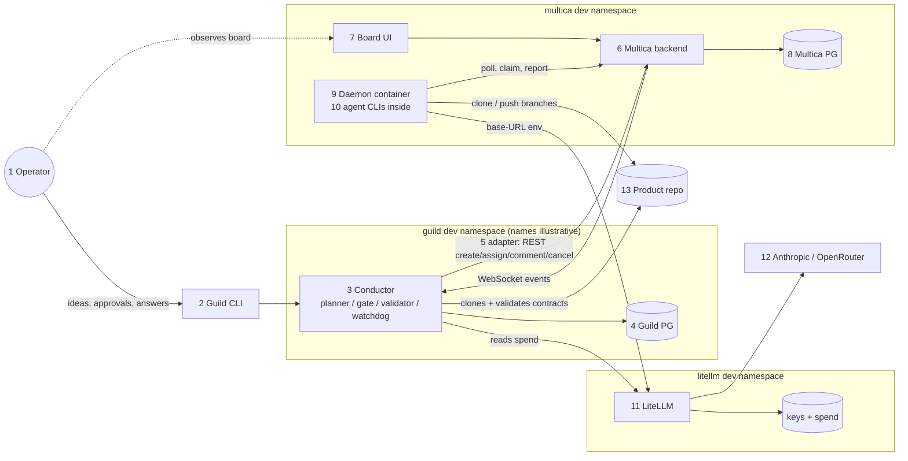
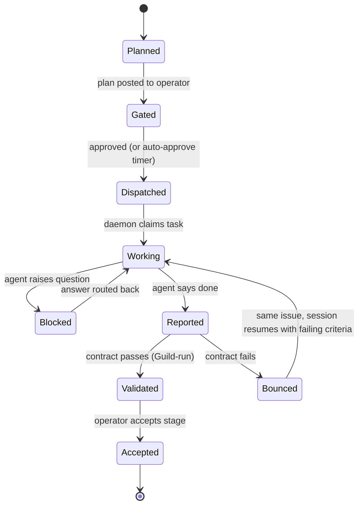
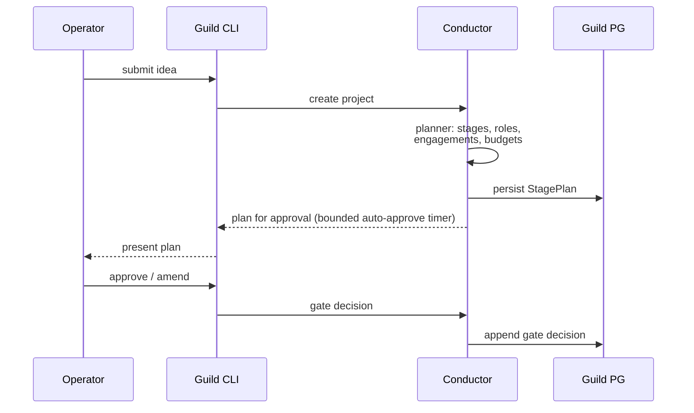
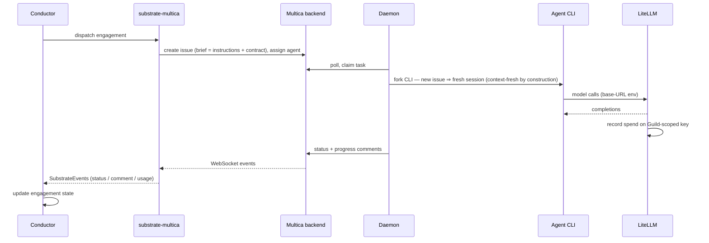
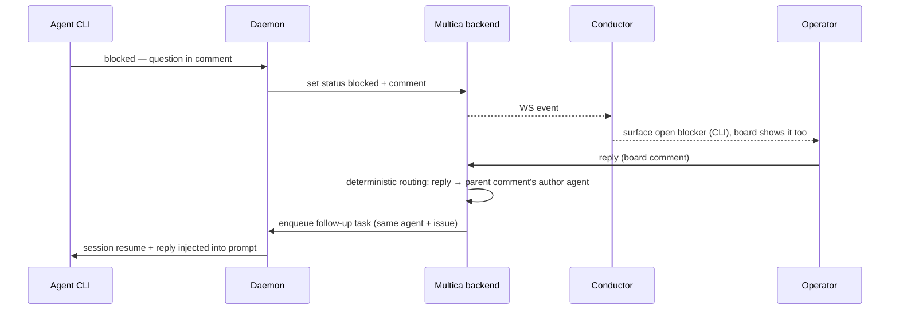
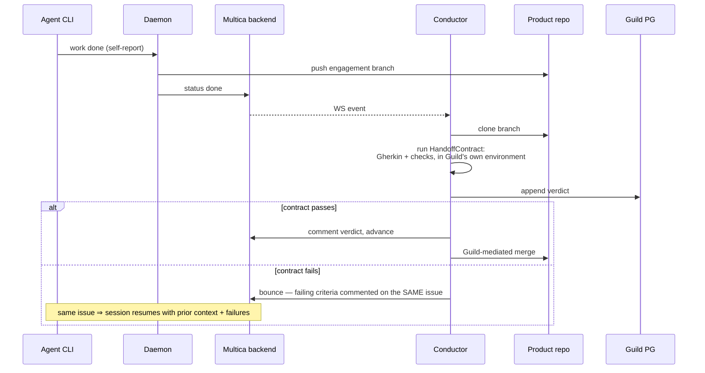
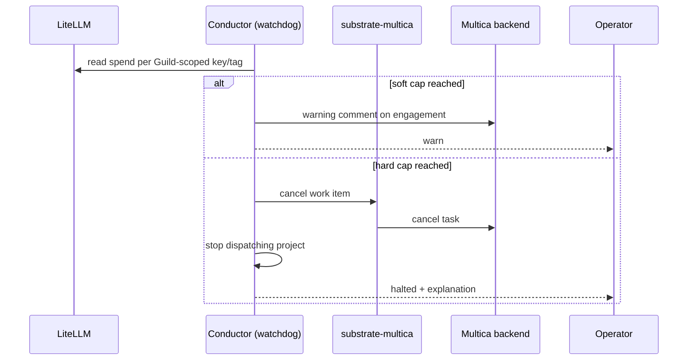

# Guild — Component & Flow Overview

One page that shows every component and every data/event flow between them. Decisions and rationale live in [ARCHITECTURE.md](ARCHITECTURE.md) (D1–D8); this page is the map. Topology shown is the M1–M2 **isolated dev stack** (kubectl-deployed, zero pre-existing services); the M3 promotion changes where things run, not how they talk.

## Components

| # | Component | Runs as | Owns / stores | Trust notes |
|---|---|---|---|---|
| 1 | **Operator** | human | final say: plan approvals, answers, stage acceptance | the only non-automated authority |
| 2 | **Guild CLI** | local binary | — (driving adapter) | talks only to the conductor |
| 3 | **Guild conductor** (`packages/orchestrator`) | K8s Deployment (dedicated dev namespace) | stage planner, approval gate, contract validator, budget watchdog | never trusts agent self-reports (D6) |
| 4 | **Guild Postgres** | in-cluster (dev) or external — dual-mode | stage plans, engagement states, append-only `decisions` (gates, verdicts, budget events) | governance provenance |
| 5 | **`substrate-multica` adapter** | library inside the conductor | translation only — no state | anti-corruption layer (D8): Multica vocabulary stops here |
| 6 | **Multica backend** | K8s Deployment (dev namespace) | REST + WebSocket API; task queue, deterministic comment routing | driven only via the `ExecutionSubstrate` port |
| 7 | **Multica frontend (board)** | K8s Deployment | kanban UI over the backend | operator's *observation* channel; approvals do **not** flow here |
| 8 | **Multica Postgres** (pgvector) | in-cluster (dev) or external — dual-mode | issues, task queue, comments, timeline (execution audit), agent sessions, `task_usage` (cost *recording*) | Multica's system of record |
| 9 | **Multica daemon** | custom container (Guild-built), K8s Deployment; gVisor at M3 | agent workspaces (PVC); forks agent CLIs as subprocesses | executes LLM-generated code — the least-trusted workload; holds only Multica token + git credentials |
| 10 | **Agent CLIs** (claude, opencode, …) | subprocesses inside the daemon | per-engagement session state (fresh per issue) | model traffic forced through the gateway via base-URL env |
| 11 | **LiteLLM gateway** (isolated dev instance) | K8s Deployment + own DB (virtual keys, per-key spend) | model routing, per-role policy, spend metering — the **enforcement** data source | sole holder of provider API keys |
| 12 | **Model providers** | external APIs (Anthropic; optionally OpenRouter; Ollama as documented option) | — | reached only from the gateway |
| 13 | **Product repo(s)** | git hosting (open question 3) | the generated application: code, contract artifacts (`features/`), branches per engagement | single-writer per branch; merges are Guild-mediated |

## System map

Two channels never exist: agents never talk to each other directly (all coordination is Multica issues/comments), and nothing but the gateway ever holds a provider key.

## Engagement lifecycle (states owned by the conductor, stored in Guild PG)

## Flows

### F1–F2 · Idea → plan → approval gate

No tokens are spent on execution before this gate — specification defects die here, at their cheapest.

### F3–F4 · Contracted dispatch → execution → metering

### F5 · Question / blocker → answer routing

Routing is Multica's verified server-side mechanism — Guild adds no correlation layer; it only surfaces open blockers and lets work that doesn't depend on the answer continue.

### F6 · Completion → contract validation → advance or bounce

The self-report is treated as hostile input (D6): the agent saying "done" starts validation, it never concludes it.

### F7 · Budget watchdog → kill-switch (M3)

Multica records cost; only the gateway's numbers can *enforce* it — that is LiteLLM's reason for existing in this architecture.

## Who stores what

| Data | Lives in | Written by | Read by |
|---|---|---|---|
| Stage plans, engagement states, gate decisions, contract verdicts, budget ledger | Guild PG (`decisions` is append-only) | conductor | conductor, operator via CLI |
| Issues, comments, timeline, task queue, agent sessions | Multica PG | Multica backend/daemon | conductor (via WS/REST), operator (board) |
| Cost *recording* per task | Multica PG (`task_usage`) | Multica | optional cross-check only |
| Virtual keys, authoritative spend | LiteLLM DB | gateway | watchdog (enforcement) |
| Generated code, contract artifacts, branches | product repo | agents (one writer per branch), Guild (merges) | validator, downstream roles (trace visibility, D6) |
| Agent workspaces | daemon PVC | daemon/CLIs | daemon |

## Trust boundaries, one line each

- **Operator ↔ Guild**: the only place authority enters; gates and acceptance are theirs.
- **Guild ↔ Multica**: one port (`ExecutionSubstrate`); Multica's vocabulary and Multica's trust in agent self-reports both stop at the adapter.
- **Daemon ↔ everything**: least-trusted (runs generated code); no provider keys, gVisor + scoped egress at M3.
- **Gateway ↔ providers**: the only key holder; every model token, in and out, is metered here.
