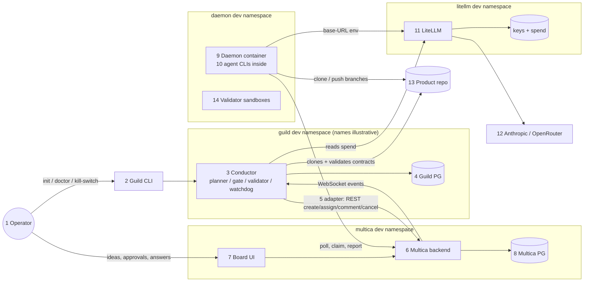
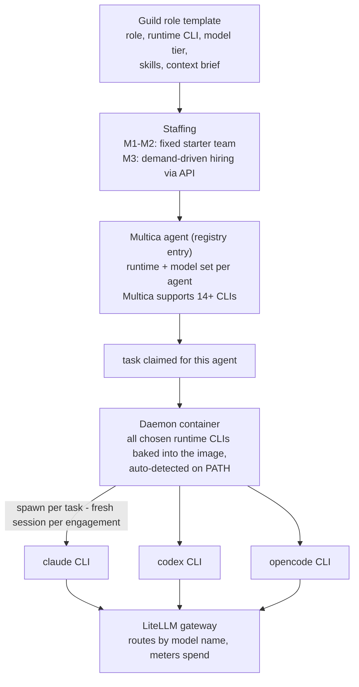
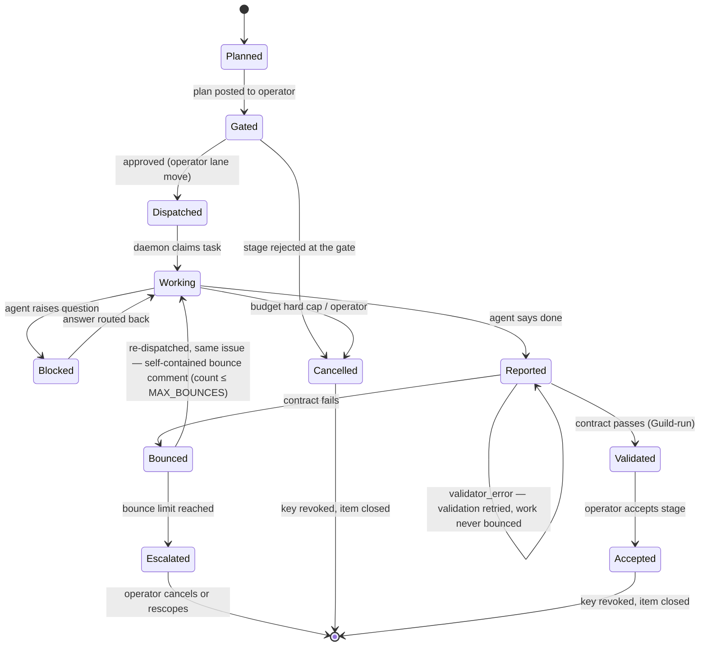
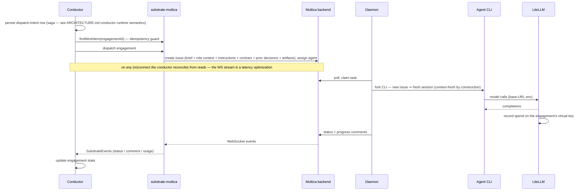
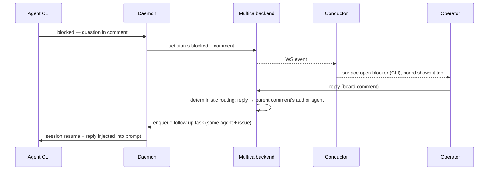
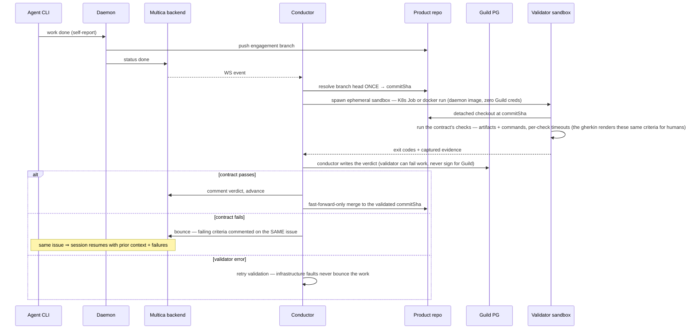
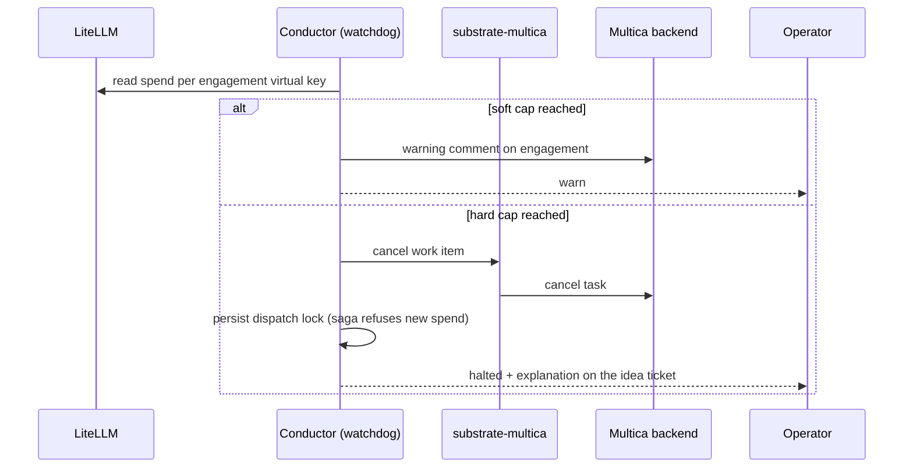

# Guild — Component & Flow Overview

One page that shows every component and every data/event flow between them. Decisions and rationale live in [ARCHITECTURE.md](ARCHITECTURE.md) (decision records, D1 onward); this page is the map. Topology shown is the **isolated dev stack** — running as **Docker Compose services through M1–M3** (same components, same trust boundaries; the namespace groupings drawn here are the Kubernetes form the optional M4 lift would move into). Zero pre-existing services either way; the lift changes where things run, not how they talk.

## Components

| # | Component | Runs as | Owns / stores | Trust notes |
|---|---|---|---|---|
| 1 | **Operator** | human | final say: plan approvals, answers, stage acceptance | the only non-automated authority |
| 2 | **Guild CLI** | local binary | — (driving adapter; D11 scope: bootstrap + emergency verbs only — `guild init`, `guild doctor`, kill-switch) | talks only to the conductor; carries no idea/approval verbs |
| 3 | **Guild conductor** (`packages/orchestrator`) | compose service (M1–M3); K8s Deployment after the optional M4 lift | stage planner, approval gate, contract validator, budget watchdog | never trusts agent self-reports (D6) |
| 4 | **Guild Postgres** | compose service (dev) or external — dual-mode | stage plans, engagement states, append-only `decisions` (gates, verdicts, budget events) | governance provenance |
| 5 | **`substrate-multica` adapter** | library inside the conductor | translation only — no state | anti-corruption layer (D8): Multica vocabulary stops here |
| 6 | **Multica backend** | compose service (M1–M3); K8s Deployment on the optional M4 lift | REST + WebSocket API; task queue, deterministic comment routing | driven only via the `ExecutionSubstrate` port |
| 7 | **Multica frontend (board)** | compose service (M1–M3); K8s Deployment on the optional M4 lift | kanban UI over the backend | the operator's **control surface** (D11): ideas, amendments, and plan approvals are tickets, comments, and lane moves here |
| 8 | **Multica Postgres** (pgvector) | compose service (dev) or external — dual-mode | issues, task queue, comments, timeline (execution audit), agent sessions, `task_usage` (cost *recording*) | Multica's system of record |
| 9 | **Multica daemon** | custom container (Guild-built) — compose service on Tier 1, K8s Deployment on Tier 2; runtime sandboxing where supported (gVisor/Kata) | agent workspaces (ephemeral volume / PVC); all chosen runtime CLIs baked in; forks the matching CLI per task | executes LLM-generated code — the least-trusted workload; holds only Multica token + git credentials |
| 10 | **Agent CLIs** (opencode is the one Guild bakes — D9 as amended; Multica itself drives 14+) | short-lived subprocesses, one per task — selected by the agent's configured runtime | per-engagement session state (fresh per issue) | model traffic forced through the gateway via the baked provider config |
| 11 | **LiteLLM gateway** (isolated dev instance) | compose service (M1–M3; K8s Deployment on the optional M4 lift) + own DB (virtual keys, per-key spend) | model routing, per-role policy, spend metering — the **enforcement** data source | sole holder of provider API keys |
| 12 | **Model providers** | external APIs (Anthropic; optionally OpenRouter; Ollama as documented option) | — | reached only from the gateway |
| 13 | **Product repo(s)** | git hosting — repo-per-project on the operator's GitHub (OQ3 resolved 2026-07-30) | the generated application: code, contract artifacts (`features/`), branches per engagement | single-writer per branch; merges are Guild-mediated, fast-forward-only to the validated SHA |
| 14 | **Contract validator** | ephemeral sandbox from the daemon image, spawned per validation (K8s Job on Kubernetes; `docker run` on Tier 1 compose) | nothing — reads a detached checkout, emits exit codes + evidence | second least-trusted workload: zero Guild credentials, registry-only egress; the conductor writes the verdict |

## System map



Two channels never exist: agents never talk to each other directly (all coordination is Multica issues/comments), and nothing but the gateway ever holds a provider key.

## Where the agents live — provisioning & runtime selection

The system map compresses the agent layer into boxes 9–10; this is what's inside. An "agent" is not a long-running process — it is (a) a **Guild role template**, (b) a **Multica agent registry entry** created from it, and (c) a **short-lived CLI process** the daemon forks per task:



- **Role → runtime → model is data, not code**: want a different CLI for the implementer than for the architect? Two role templates with different `runtime` values; staffing creates two Multica agents; the daemon forks whichever CLI each task's agent specifies. Verified Multica mechanics: agents carry a per-agent runtime + model choice, and the daemon auto-detects installed CLIs. (The shipped image bakes OpenCode only — D9 as amended; adding a runtime is the three-move procedure below.)
- **Per-task spawn, not per-agent servers**: nothing idles between engagements; "spinning up an agent" costs a process fork, and context-freshness falls out of it (one issue per engagement, D6/lifecycle above).
- **Adding a runtime = three moves**: install the CLI in the daemon image (`docker/daemon/`), add its provider route to the gateway if it needs one, reference it in a role template. Nothing in the conductor changes — runtime identity never crosses the `ExecutionSubstrate` port.
- **Placement & scale**: multiple daemons register as separate Multica runtimes — **proven live** (capability matrix P9, pass-with-workaround: container recreation orphans the old runtime row and strands its queued tasks; the documented repair is rebind + cancel + rerun). One daemon runs claimed tasks **in parallel** (P8: machine-level slot semaphore, default 20). Heavy roles can therefore get their own daemon service (compose) or Deployment (K8s) later without design change.
- **Why only LiteLLM showed up as "the gateway"**: it is the *model* layer under every runtime — one policy and one budget regardless of which CLI is doing the work. The *agent* layer is this section.

## Engagement lifecycle (states owned by the conductor, stored in Guild PG)



## Flows

### F1–F2 · Idea → plan → approval gate (board-mediated, D11/D12)

```mermaid
sequenceDiagram
    participant OP as Operator
    participant BE as Multica board
    participant C as Conductor
    participant G as Guild PG
    OP->>BE: idea as a board ticket
    BE-->>C: item_created (creator-attributed, P24)
    C->>C: planner (D12): fixed stage template,<br/>roles, integer-cent budgets - deterministic
    C->>G: persist plan run + stage plan v1
    C->>BE: stage gate ticket (Waiting for feedback)
    opt amendment
        OP->>BE: comment "amend: <note>" on the gate ticket
        C->>G: amended decision; v1 engagements superseded
        C->>BE: gate ticket v2 replaces v1 (re-gate)
    end
    OP->>BE: move gate ticket to Ready to work
    BE-->>C: lane_moved (operator-attributed)
    C->>G: gate approval (first writer wins)
```

The idea is a ticket, the plan is a ticket, the lane move is the approval — there is no idea CLI verb (D11). Stage k+1 is derived only after stage k is accepted: its contract folds in the upstream handoff read from the validated SHA (D12). No tokens are spent on execution before the gate — specification defects die here, at their cheapest.

### F3–F4 · Contracted dispatch → execution → metering



### F5 · Question / blocker → answer routing



Routing is Multica's verified server-side mechanism — Guild adds no correlation layer; it only surfaces open blockers and lets work that doesn't depend on the answer continue.

### F6 · Completion → contract validation → advance or bounce



The self-report is treated as hostile input (D6): the agent saying "done" starts validation, it never concludes it.

### F7 · Budget watchdog → kill-switch (M2b)



The lock records the hard cap in force when set and releases only when the configured cap is raised **above** that value at conductor start (raise-and-restart, D12/**D14**) — never automatically, and never on spend dipping below the cap. `guild kill` uses the same lock and records the current hard cap, so the kill switch stays engaged until the operator raises the cap and restarts — it does not self-release on the next watchdog tick (audit #17 A1).

Multica records cost; only the gateway's numbers can *enforce* it — that is LiteLLM's reason for existing in this architecture.

## Who stores what

| Data | Lives in | Written by | Read by |
|---|---|---|---|
| Stage plans, engagement states, gate decisions, contract verdicts, budget ledger | Guild PG (`decisions` is append-only) | conductor | conductor, operator via CLI |
| Issues, comments, timeline, task queue, agent sessions | Multica PG | Multica backend/daemon | conductor (via WS/REST), operator (board) |
| Cost *recording* per task | Multica PG (`task_usage`) | Multica | optional cross-check only |
| Virtual keys, authoritative spend | LiteLLM DB | gateway | watchdog (enforcement) |
| Generated code, contract artifacts, branches | product repo | agents (one writer per branch), Guild (merges) | validator, downstream roles (trace visibility, D6) |
| Agent workspaces | daemon ephemeral volume (compose) / PVC (K8s) | daemon/CLIs | daemon |

## Trust boundaries, one line each

- **Operator ↔ Guild**: the only place authority enters; gates and acceptance are theirs.
- **Guild ↔ Multica**: one port (`ExecutionSubstrate`); Multica's vocabulary and Multica's trust in agent self-reports both stop at the adapter.
- **Daemon ↔ everything**: least-trusted (runs generated code); no provider keys; compose-era (M1–M3) bounds are the container boundary + explicit approvals + `max_budget` caps; the K8s controls (scoped egress, least-privilege, runtime sandboxing) land with the optional M4 lift, if pursued — until then their absence is a documented residual risk (`deploy/README.md` security floor).
- **Validator ↔ Guild**: the validator executes agent-authored checks — hostile input — so it is a trust-peer of the daemon (ephemeral sandbox: K8s Job or `docker run`, zero Guild credentials); it can fail work but never signs for Guild.
- **Gateway ↔ providers**: the only key holder; every model token, in and out, is metered here.
